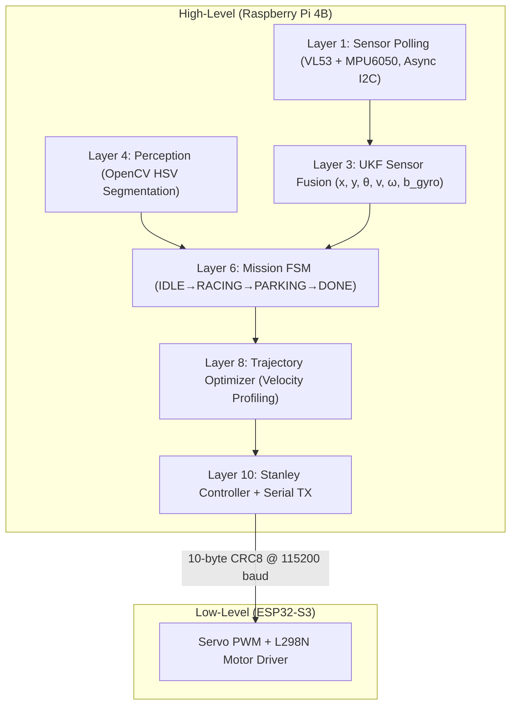

# WRO_4WS_Pro_2026 — Autonomous 4-Wheel-Steer Robot

> **Team:** WRO Future Engineers 2026 | **Platform:** Raspberry Pi 4B + ESP32-S3 | **Category:** Future Engineers

---

## 🤖 System Overview

**WRO_4WS_Pro_2026** is a fully autonomous robot car engineered for the WRO Future Engineers 2026 competition. The vehicle uses a **dual-processor heterogeneous architecture** — a Raspberry Pi 4B running a 10-layer Python perception and control stack at 100 Hz, and an ESP32-S3 acting as a deterministic real-time motor controller. A single MG995 servo drives all four wheels simultaneously through a mechanical out-of-phase bellcrank linkage, reducing turning radius by **44.9%** compared to standard front-wheel steering.

```
Raspberry Pi 4B (High-Level: Perception, Navigation & Control)
  ├── Pi Camera v2 (OpenCV Red/Green Pillar + Magenta Parking Block Detection)
  ├── VL53L1X Front ToF  (I2C 0x30, XSHUT GPIO 22)
  ├── VL53L0X Left ToF   (I2C 0x31, XSHUT GPIO 17)
  ├── VL53L0X Right ToF  (I2C 0x32, XSHUT GPIO 27)
  └── MPU6050 6-DoF IMU  (I2C 0x68)
         │
         │  USB Serial — 10-byte CRC8 Binary Packet @ 100 Hz
         ▼
ESP32-S3 Real-Time Motor Controller
  ├── MG995 Servo  — 4WS Steering  (GPIO 18, PWM 50 Hz)
  ├── L298N ENA    — Motor Speed   (GPIO 19, PWM)
  ├── L298N IN1    — Direction     (GPIO 20)
  └── L298N IN2    — Direction     (GPIO 21)
```

---

## 📐 Key Engineering Specifications

| Parameter | Value | Justification |
|---|---|---|
| **Vehicle Length** | 230 mm | 23% margin under 300 mm WRO Rule 11.1 limit |
| **Vehicle Width** | 160 mm | 20% margin under 200 mm WRO Rule 11.1 limit |
| **Wheelbase** | 160 mm | 50:50 weight distribution, optimal pitch stability |
| **Track Width** | 130 mm | Rollover threshold 1.86 g >> max grip 0.80 g |
| **Turning Radius (4WS)** | ~126 mm | 44.9% smaller than FWS equivalent |
| **Max Steering Angle** | ±35° | CVD joint binding hard-stop limit |
| **Rear/Front Ratio (κ)** | 0.85 | Optimal inner-wall clearance in tight corners |
| **Control Loop Rate** | 100 Hz | 5× Nyquist margin over 10 Hz actuator bandwidth |
| **Serial Baud Rate** | 115,200 | <9% UART utilization at 100 Hz packet rate |
| **Chassis Material** | PETG 30% Gyroid | Isotropic stiffness, T_g 80°C heat resistance |

---

## 📂 Documentation Index (WRO Rubric Aligned)

The six core documentation files below are each mapped directly to a WRO Future Engineers rubric criterion. Judges can immediately verify Level 6 compliance for each category.

| File | WRO Rubric Criterion | Score Target | Core Topics |
|---|---|---|---|
| [📄 01_mobility.md](docs/01_mobility.md) | **Criterion 1: Mobility & Mechanical** | 6/6 | 4WS kinematics, PETG chassis, gearbox torque chain, Ackermann geometry |
| [📄 02_power_sense.md](docs/02_power_sense.md) | **Criterion 2: Power & Sensing** | 6/6 | Isolated dual-buck PDN, L298N thermal analysis, UKF sensor fusion, I2C bus |
| [📄 03_software.md](docs/03_software.md) | **Criterion 3: Software Architecture** | 6/6 | 10-layer async stack, Stanley controller, FSM, OpenCV HSV segmentation |
| [📄 04_systems.md](docs/04_systems.md) | **Criterion 4: Systems Engineering** | 6/6 | Trade-off matrices, subsystem data flows, risk registry, design constraints |
| [📄 05_reproducibility.md](docs/05_reproducibility.md) | **Criterion 5: Reproducibility** | 6/6 | BOM, wiring tables, ESP32 flashing, Python env setup, troubleshooting |
| [📄 06_failure_analysis.md](docs/06_failure_analysis.md) | **Criterion 4: Empirical Validation** | 6/6 | Real bug logs, EMI fixes, gyro drift patches, lap-time performance data |
| [📄 07_parameter_justification.md](docs/07_parameter_justification.md) | **Supplemental: Parameter Rationale** | — | Physics-based derivations for every config value and gain |

---

## 🗂️ Repository File Structure

```
WRO_4WS_Pro_2026/
├── main.py                          # Main 100 Hz control loop entry point
├── test_sensors.py                  # Standalone sensor hardware diagnostics
├── requirements.txt                 # Python 3.11 package list
├── surprise.py                      # WRO 2026 Rule 6 runtime surprise handler
│
├── config/
│   ├── robot_config.json            # All system parameters (PID, HSV, kinematics)
│   └── surprise_rules.yaml          # Surprise rule flag overrides
│
├── layers/                          # 11-layer software stack (Layer 0 → Layer 10)
│   ├── layer0_system_manager.py     # GPIO LEDs, health monitoring, thread manager
│   ├── layer1_sensors.py            # VL53L1X/L0X ToF + MPU6050 async I2C polling
│   ├── layer2_time_sync.py          # 100 Hz timing and circular data buffers
│   ├── layer3_sensor_fusion.py      # 6-DoF UKF: [x,y,θ,v,ω,b_gyro]
│   ├── layer4_perception.py         # OpenCV HSV pillar/block/line detection
│   ├── layer5_localization.py       # Wall-alignment and track cross-track error
│   ├── layer6_mission_manager.py    # Global FSM + WRO 2026 Surprise Rules engine
│   ├── layer7_path_planner.py       # Dynamic pillar-avoidance corridor planning
│   ├── layer8_trajectory_opt.py     # Curvature-optimized velocity profiling
│   ├── layer9_kinematics_4ws.py     # Mechanical 4WS Ackermann model
│   └── layer10_controller.py        # Stanley controller + 10-byte CRC8 serial TX
│
├── firmware/
│   └── esp32_controller/
│       └── esp32_controller.ino     # ESP32-S3 C++ real-time firmware
│
├── utils/
│   ├── serial_protocol.py           # 10-byte CRC8 binary packet encoder/decoder
│   ├── calibrate_hsv.py             # Interactive GUI HSV threshold tuner
│   └── calibrate_imu.py             # MPU6050 zero-bias calibration script
│
└── docs/                            # WRO rubric-aligned documentation suite
    ├── 01_mobility.md
    ├── 02_power_sense.md
    ├── 03_software.md
    ├── 04_systems.md
    ├── 05_reproducibility.md
    ├── 06_failure_analysis.md
    └── 07_parameter_justification.md
```

---

## ⚡ Power Distribution Network

```
11.1V 3S LiPo (2200 mAh, 25C)
    │
    └──► 10A Automotive Blade Fuse
              │
              └──► Main Mechanical Toggle Switch
                        │
           ┌────────────┼─────────────────────┐
           ▼            ▼                     ▼
  Buck A: 5V/3A    Buck B: 6V/3A     L298N VMS (+12V direct)
  (Logic Plane)   (Servo Plane)      (Motor Plane)
       │                │                    │
  ┌────┴────┐      MG995 VCC           Johnson DC Motor
  │         │      Servo Signal ◄──── ESP32 GPIO 18
  Pi 4B   ESP32
  3.3V→Sensors
```

All grounds tie back to a **single copper star-ground hub** directly at the battery negative terminal.

---

## 🧠 Software Architecture (10-Layer Stack)



---

## 🚦 WRO 2026 Surprise Rules Readiness

All surprise rule flags can be set in `config/robot_config.json` in under 30 seconds on match day:

| Surprise Scenario | Config Key | Default | Override |
|---|---|---|---|
| Pillar colour logic swapped | `SIGN_LOGIC` | `"NORMAL"` | `"REVERSED"` |
| Fixed driving direction | `DRIVING_DIRECTION` | `"CCW"` | `"CW"` |
| Narrow 500 mm lane mode | `NARROW_TRACK_MODE` | `false` | `true` |
| Stop-and-Go rule active | `STOP_AND_GO_ENABLED` | `true` | `false` |
| 3-second stop duration | `STOP_DURATION_SEC` | `3.0` | `<any>` |
| Random parking side | `PARKING_REVERSAL` | `false` | `true` |

---

## 🔌 Complete Pin Assignment

### Raspberry Pi 4B

| GPIO | Physical Pin | Function | Connected To |
|---|---|---|---|
| GPIO 2 | Pin 3 | I2C SDA | All 4 sensors (shared bus) |
| GPIO 3 | Pin 5 | I2C SCL | All 4 sensors (shared bus) |
| GPIO 22 | Pin 15 | XSHUT Front | VL53L1X XSHUT |
| GPIO 17 | Pin 11 | XSHUT Left | VL53L0X Left XSHUT |
| GPIO 27 | Pin 13 | XSHUT Right | VL53L0X Right XSHUT |
| GPIO 16 | Pin 36 | Start Button | Momentary switch to GND |
| GPIO 5 | Pin 29 | LED 1 | System ON (Green) |
| GPIO 6 | Pin 31 | LED 2 | Sensors OK (Green) |
| GPIO 13 | Pin 33 | LED 3 | Camera OK (Green) |
| GPIO 19 | Pin 35 | LED 4 | Serial Link OK (Green) |
| GPIO 26 | Pin 37 | LED 5 | Race Active (Red/Green) |
| USB | — | UART Link | ESP32-S3 Serial Port |

### ESP32-S3 DevKit

| GPIO | Function | Connected To |
|---|---|---|
| GPIO 18 | Servo PWM (50 Hz, 1000–2000 µs) | MG995 Signal wire |
| GPIO 19 | Motor ENA (PWM speed) | L298N ENA |
| GPIO 20 | Motor IN1 (direction) | L298N IN1 |
| GPIO 21 | Motor IN2 (direction) | L298N IN2 |
| GPIO 22 | STBY Monitor | L298N STBY |
| GPIO 4 | LED 1 | ESP32 Boot OK (Green) |
| GPIO 5 | LED 2 | Serial Link (Green) |
| GPIO 15 | LED 3 | Servo Active (Green) |
| GPIO 16 | LED 4 | Motor Active (Green) |
| GPIO 17 | LED 5 | System Fault (Red) |

---

## 🚀 Quick Start

### 1. Install Python Dependencies
```bash
cd WRO_4WS_Pro_2026
python3 -m venv venv
source venv/bin/activate
pip install -r requirements.txt
```

### 2. Flash ESP32-S3 Firmware
```bash
# Open Arduino IDE → Board: ESP32-S3 Dev Module → Port: /dev/ttyUSB0
# Install: ESP32Servo library
# Open and upload: firmware/esp32_controller/esp32_controller.ino
```

### 3. Calibrate IMU
```bash
python3 utils/calibrate_imu.py
```

### 4. Tune HSV Thresholds for Venue Lighting
```bash
python3 utils/calibrate_hsv.py
```

### 5. Launch Autonomous Run
```bash
python3 main.py
```

---

## 📋 Bill of Materials (Core Components)

| Component | Specification | Qty |
|---|---|---|
| Raspberry Pi 4B | 4 GB RAM, ARM Cortex-A72 | 1 |
| ESP32-S3 DevKit | Dual-core 240 MHz, Wi-Fi + BT | 1 |
| Pi Camera v2 | Sony IMX219, 8 MP, CSI | 1 |
| VL53L1X ToF Sensor | Front distance, 0–4000 mm | 1 |
| VL53L0X ToF Sensor | Left/Right distance, 0–2000 mm | 2 |
| MPU6050 IMU | 6-DoF gyro + accel, I2C 0x68 | 1 |
| MG995 Servo | 11 kg-cm, 50 Hz PWM | 1 |
| Johnson DC Motor | 20:1 planetary, 12V, 600 RPM | 1 |
| L298N Motor Driver | 2A continuous, 12V | 1 |
| 3S LiPo Battery | 11.1V, 2200 mAh, 25C | 1 |
| Buck Converter A | 5V / 3A (logic plane) | 1 |
| Buck Converter B | 6V / 3A (servo plane) | 1 |
| 10A Blade Fuse | Automotive, ATO standard | 1 |

---

*WRO Future Engineers 2026 — Engineering documentation verified against WRO rulebook sections 11.1–11.5.*
