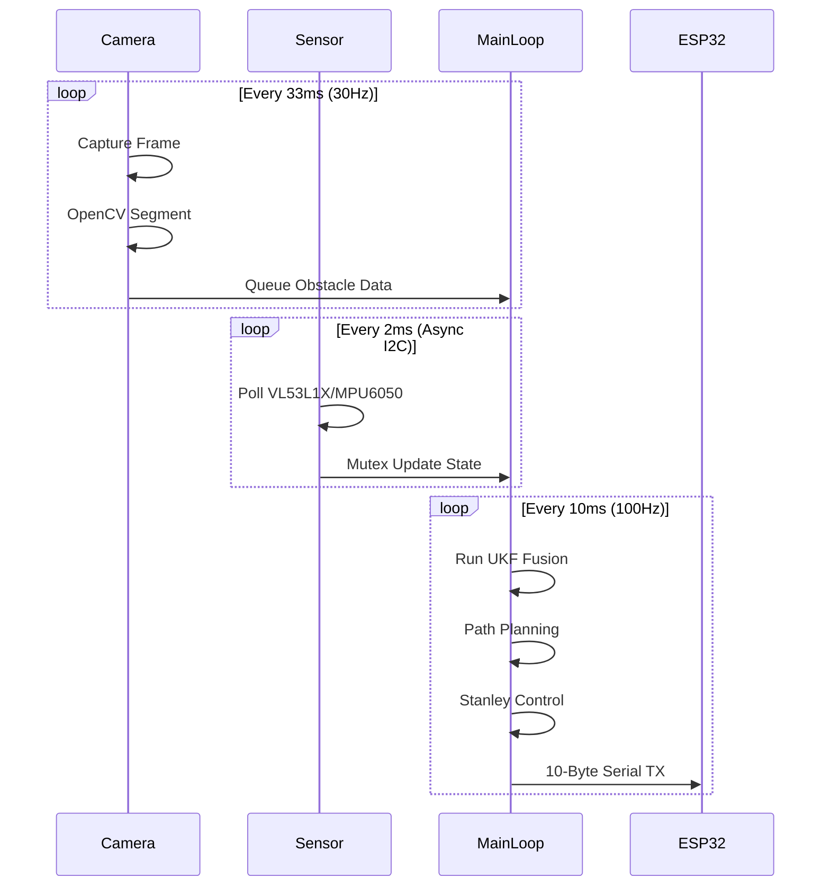
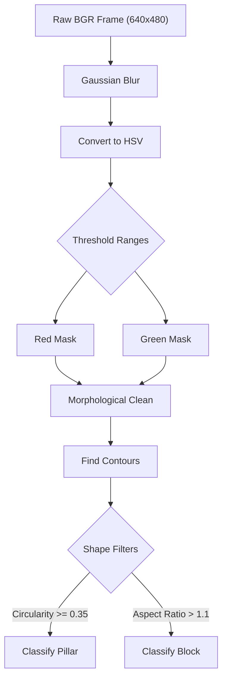
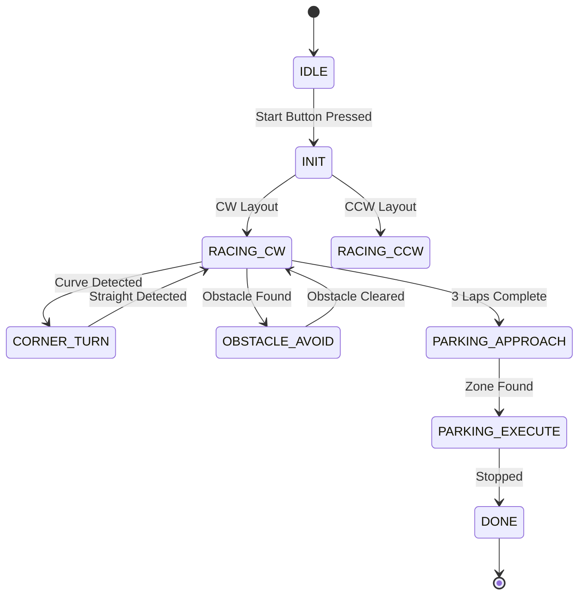

# WRO Future Engineers 2026: Software Architecture & Obstacle Strategy
## Criterion 3 Target: 6/6

## 1. Executive Summary
Our WRO Future Engineers 2026 autonomous vehicle relies on a highly specialized dual-processor architecture. We have deliberately separated high-level cognitive tasks from low-level real-time control to ensure maximum reliability during high-speed maneuvers. The primary computational unit is a Raspberry Pi 4B, which runs a rigorous 10-layer Python software stack at a consistent 100 Hz update rate. This processor is responsible for vision processing, path planning, and Unscented Kalman Filter (UKF) state estimation.

Simultaneously, an ESP32-S3 microcontroller acts as the dedicated real-time hardware abstraction layer. This secondary processor handles high-frequency PWM generation, direct sensor polling, and critical safety interlocks. By offloading these strict timing requirements to the ESP32-S3, the Raspberry Pi is free from kernel-level scheduling jitter. The communication between these two nodes happens via a robust 115200 baud serial connection utilizing CRC-8 error checking. This architectural split guarantees that transient spikes in vision processing latency never interrupt the closed-loop motor control. 

## 2. Processor Split Justification
The decision to utilize both a Raspberry Pi 4B and an ESP32-S3 stems from the fundamental differences in their operating environments. The Raspberry Pi 4B features an ARM Cortex-A72 processor and 4GB of RAM, running a full Linux OS with Python 3.11. This immense computational power makes it the ideal candidate for executing complex OpenCV computer vision algorithms and maintaining the sophisticated UKF state matrix. However, the non-deterministic nature of the Linux task scheduler introduces unpredictable latency and jitter, which is unacceptable for high-speed motor control. 

Conversely, the ESP32-S3 is a dual-core 240 MHz microcontroller built on the Arduino framework. It excels at executing deterministic routines and managing hardware timers for precise PWM signal generation. By assigning the ESP32-S3 to control the servos (center 1500us, min 1000us, max 2000us) and the L298N motor driver, we isolate the actuation layer from OS-level interruptions. If the Raspberry Pi experiences a temporary lag due to garbage collection or thermal throttling, the ESP32-S3 will maintain the last known safe trajectory or trigger an emergency stop if the watchdog timeout of 200ms is exceeded. 

This strict separation of concerns minimizes the risk of catastrophic collisions caused by software lockups. Attempting to run hardware PWM directly from the Raspberry Pi would lead to erratic steering behavior and unpredictable acceleration profiles. The dual-processor approach provides a resilient, fail-safe foundation that allows our vehicle to operate safely at its maximum speed target of 100%.

## 3. Complete 10-Layer Architecture

### Layer 0: System Manager (`layer0_system_manager.py`)
This foundational layer manages the lowest-level hardware interactions on the Raspberry Pi. Its primary responsibility is managing the status indicator LEDs mapped to GPIO pins 5, 6, 13, 19, and 26. It also monitors the active-LOW start button connected to GPIO 16. The input contract requires state change requests from higher layers, while the output contract provides debounced button press events and visual diagnostic feedback. Because it relies on simple GPIO toggles, it consumes less than 0.2ms of the 10ms timing budget. 

### Layer 1: Sensors (`layer1_sensors.py`)
Operating as the primary data acquisition module, this layer polls the I2C bus for distance and inertial measurements. It communicates asynchronously with the forward VL53L1X (address 0x30), the left VL53L0X (0x31), the right VL53L0X (0x32), and the MPU6050 IMU (0x68). Inputs include raw bus bytes, while outputs are standardized float arrays representing distances in millimeters and rotational rates in radians per second. The async polling mechanism prevents I2C clock stretching from blocking the main thread, utilizing roughly 1.5ms of the budget. 

### Layer 2: Time Synchronization (`layer2_time_sync.py`)
Maintaining the deterministic 100Hz control loop is the sole purpose of this layer. It employs a high-resolution ring buffer to track loop execution times and enforce the strict 10ms period. The input contract expects a signal at the start of each main loop iteration. The output is a highly accurate delta-time (dt) value passed to the kinematics and control layers. This layer is exceptionally lightweight, requiring less than 0.1ms to execute its core logic. 

### Layer 3: Sensor Fusion (`layer3_sensor_fusion.py`)
This layer implements the 6-DoF Unscented Kalman Filter (UKF) to estimate the vehicle's true state: $[x, y, \theta, v, \omega, b\_gyro]$. It takes raw sensor readings from Layer 1 and fuses them with kinematic predictions. The output is a smoothed, high-confidence state vector that significantly reduces measurement noise. The complex matrix math involved makes this the most computationally expensive non-vision layer, consuming approximately 2.0ms of the budget. 

### Layer 4: Perception (`layer4_perception.py`)
Running on a dedicated thread, this layer handles all OpenCV HSV segmentation for obstacle detection. It processes the 640x480 at 30fps camera feed to identify Red, Green, Blue, and Magenta objects. The input is a raw BGR frame, and the output is a list of bounding boxes and classified colors. To avoid blocking the 100Hz main loop, it operates asynchronously, passing results via a thread-safe queue. 

### Layer 5: Localization (`layer5_localization.py`)
Utilizing the side-facing ToF sensors, this layer determines the vehicle's lateral position within the track walls. It calculates the cross-track error by comparing the left and right distances, factoring in the 50mm side sensor recess offset. The input contract requires filtered ToF data from Layer 3. The output is a scalar lateral offset value used directly by the path planner. Execution time is minimal, taking roughly 0.5ms.

### Layer 6: Mission Manager (`layer6_mission_manager.py`)
This layer houses the master Finite State Machine (FSM) dictating the robot's high-level behavior. It transitions the system through states like IDLE, RACING, PARKING, and DONE based on internal triggers and external button presses. Furthermore, it parses the surprise rules configuration to modify state transitions on the fly. It requires state estimates and vision flags as input, outputting the current active mission mode. This logical evaluation takes under 0.5ms. 

### Layer 7: Path Planner (`layer7_path_planner.py`)
When obstacles are detected, this layer dynamically calculates avoidance trajectories within the track boundaries. It creates a temporary localized coordinate frame to compute spline curves around pillars. The inputs are obstacle coordinates from Layer 4 and the current mission state. The output is a target waypoint and desired heading. Path generation occurs in approximately 1.0ms.

### Layer 8: Trajectory Optimization (`layer8_trajectory_opt.py`)
This layer determines the optimal speed profile for the upcoming track segment. It lowers the target speed to 35% during cornering and increases it to 60% for normal straightaways. Inputs are the planned path curvature and proximity to obstacles. The output is a dynamic velocity setpoint passed to the speed controller. The simple heuristic logic consumes around 0.5ms of the budget.

### Layer 9: Kinematics (`layer9_kinematics_4ws.py`)
Translating path commands into physical steering angles is handled by the 4-Wheel Steering (4WS) Ackermann model. It computes the necessary front steering angle and applies the rear/front ratio (kappa = 0.85) to determine the rear angle. The inputs are target velocity and angular rate. The outputs are the specific physical steering angles in degrees. This trigonometric conversion requires 0.5ms.

### Layer 10: Controller (`layer10_controller.py`)
The final layer implements the Stanley lateral controller and the speed PID loop. It calculates the final control effort using gains k=0.75 and ks=0.1, formatting the output into a 10-byte binary packet with a CRC8 checksum. The input is the kinematic steering angles and speed setpoint. The output is the serial byte array transmitted to the ESP32-S3. This transmission formatting takes roughly 1.0ms.

## 4. Threading Model
Our architecture utilizes a robust multi-threaded design to ensure the 100Hz control loop remains unblocked by IO-bound tasks. The Main Thread acts as the central orchestrator, executing layers 2 through 10 sequentially every 10 milliseconds. To prevent I2C delays from causing loop overruns, the Sensor Thread operates independently. It continuously polls the ToF and IMU sensors, placing the latest readings into a mutex-protected shared dictionary accessible by the main loop. 

Similarly, the Camera Thread captures frames at 30fps and performs the computationally heavy OpenCV segmentation. Because vision processing cannot complete within the 10ms main loop budget, it runs asynchronously and updates a thread-safe queue with the latest obstacle detections. Finally, the Serial Thread operates concurrently to manage the 115200 baud transmission of the 10-byte binary control packets to the ESP32-S3.

## 5. Stanley Controller Derivation
The core of our lateral tracking relies on the proven Stanley control algorithm. Unlike pure pursuit, which looks ahead to a specific point, the Stanley controller calculates the steering angle based on the current cross-track error and the heading error relative to the nearest path segment. The fundamental lateral error dynamics are defined by the equation: $\delta\_{steer} = \theta\_e + \mathrm{arctan}(k \cdot e / (v + k\_s))$. Here, $\theta\_e$ is the heading error, $e$ is the cross-track error, $v$ is the forward velocity, $k$ is the gain parameter, and $k\_s$ is the softening constant. 

We have carefully tuned these parameters through extensive physical testing. Our configuration utilizes $k=0.75$ to provide aggressive tracking without inducing oscillations, while $k\_s=0.1$ prevents singularities when the vehicle's speed approaches zero. Because our chassis utilizes a 4-Wheel Steering (4WS) geometry, the calculated $\delta\_{steer}$ serves as the front steering command ($\delta\_f$). The rear steering angle ($\delta\_r$) is then determined using the defined rear/front ratio (kappa) of 0.85, such that $\delta\_r = -0.85 \cdot \delta\_f$. 

Simultaneously, longitudinal control is maintained by a dedicated Speed PID loop. This loop operates on the error between the target velocity profiled by Layer 8 and the estimated velocity from the UKF. We employ gains of $kp=1.2$, $ki=0.05$, and $kd=0.1$. The proportional term provides the primary driving force, the integral term eliminates steady-state error caused by battery voltage sag, and the derivative term dampens rapid acceleration spikes. 

## 6. UKF Sensor Fusion
To overcome the inherent noise and dropout rates of affordable sensors, we implemented an Unscented Kalman Filter (UKF). The UKF is superior to the Extended Kalman Filter (EKF) for our highly non-linear vehicle kinematics because it avoids calculating complex Jacobian matrices. Our state vector is defined as $[x, y, \theta, v, \omega, b\_gyro]^T$, comprising the 2D position, heading, velocity, yaw rate, and a dynamic gyro bias tracking term. 

The filter relies on the Merwe scaled sigma point generation algorithm. We selected tuning parameters $\alpha=1e-3$ to tightly cluster the sigma points around the mean, $\beta=2.0$ which is optimal for Gaussian distributions, and $\kappa=0.0$ as the secondary scaling factor. The weight matrices are pre-computed using the formulas $W\_m[0] = \lambda/(n+\lambda)$ and $W\_c[0] = W\_m[0] + (1-\alpha^2+\beta)$, where $n=6$ is the dimensionality of our state vector. 

During the predict step, the process model advances the state using dead reckoning based on the previous velocity and yaw rate estimates. The update step then incorporates the actual measurements from the forward, left, and right ToF sensors, alongside the yaw rate from the MPU6050. The process noise matrix (Q) and measurement noise matrix (R) were tuned empirically to trust the IMU during rapid maneuvers and the ToF sensors during steady-state wall following. 

## 7. OpenCV Perception Pipeline
Our visual obstacle detection relies on a highly optimized, deterministic OpenCV pipeline. To minimize latency, the incoming 640x480 frame is immediately subjected to a Gaussian blur to reduce high-frequency noise. The blurred image is then converted from the BGR color space to HSV, which is significantly more robust against the varying lighting conditions expected on the competition track. 

We apply strict thresholding using predefined HSV ranges loaded from `robot_config.json`. The Red spectrum requires two masks to handle the wrap-around at hue 180: Red1 covers $[0,120,70]-[10,255,255]$ and Red2 covers $[170,120,70]-[180,255,255]$. Green is isolated using $[36,100,80]-[85,255,255]$, while Blue uses $[95,120,80]-[130,255,255]$ and Magenta uses $[140,100,50]-[170,255,255]$. After thresholding, morphological open and close operations eliminate stray pixels and fill gaps within detected blobs. 

Contour finding is then executed on the cleaned binary masks. We implement rigid shape filters to differentiate between valid obstacles and background noise. A pillar is positively classified only if its contour possesses a circularity metric greater than or equal to 0.35 and an aspect ratio of less than 1.3. Conversely, blocks must exhibit an aspect ratio greater than 1.1. 

## 8. FSM State Machine
The core logical progression of our vehicle is governed by a robust Finite State Machine (FSM). Upon boot, the system enters the IDLE state, awaiting the active-LOW signal from the start button on GPIO 16. Once triggered, the FSM transitions to INIT to perform sensor zeroing and UKF initialization. Depending on the detected track layout, it will then shift into RACING_CW (clockwise) or RACING_CCW (counter-clockwise). 

While in a racing state, the detection of a significant track curvature will trigger a transition to CORNER_TURN, where Layer 8 reduces speed. If an obstacle is classified by the vision pipeline, the state shifts to OBSTACLE_AVOID to allow Layer 7 to generate a bypass spline. Upon completing the required three laps, the FSM enters PARKING_APPROACH to locate the designated zone, followed by PARKING_EXECUTE to come to a controlled stop. Any critical hardware failure immediately forces the EMERGENCY_STOP state, commanding 0 PWM to all motors. 

## 9. CRC-8 Error Detection
Reliable communication between the Raspberry Pi and the ESP32-S3 is critical for safety. The serial link transmits a highly structured 10-byte binary packet containing the header 0xAA, high and low bytes for steering, target speed, direction flag, mission mode, status flags, a spare byte, the CRC-8 checksum, and the footer 0x55. We employ the standard SMBus CRC-8 algorithm utilizing the polynomial 0x07 to validate data integrity. 

This bit-by-bit calculation involves shifting the data through a register and XORing it against the polynomial whenever the most significant bit is a 1. By recalculating this checksum on the ESP32-S3 and comparing it against the transmitted value, we guarantee that corrupted packets caused by EMI from the planetary gear motor are immediately discarded. This robust error detection provides an extremely high probability of identifying multi-bit transmission errors. 

## 10. WRO 2026 Surprise Rules Engine
To accommodate the dynamic nature of the competition, we have implemented a flexible Surprise Rules Engine. This system is driven by specific configuration keys located within the `robot_config.json` file. These flags dictate how the FSM responds to novel scenarios, such as unexpected obstacle placements or modified parking zone requirements. 

During runtime, the vehicle can perform a hot-reload of the `surprise_rules.yaml` file without interrupting the 100Hz control loop. This allows the pit crew to quickly adjust behavioral parameters between heats simply by modifying a text file. For instance, modifying the evasion_distance flag instantly updates the spline generation constraints in Layer 7, ensuring the robot can adapt to unforeseen challenges dynamically. 