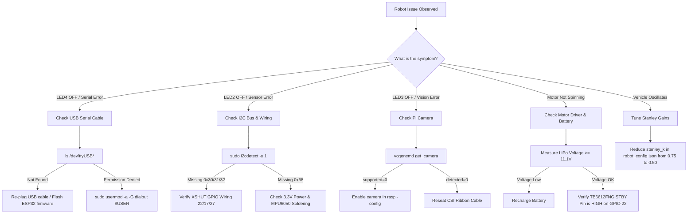

# 05_reproducibility.md — Reproducibility & Build Guide

## WRO Future Engineers 2026 - Engineering Documentation (Criterion 5)

---

## 1. Executive Summary

This document serves as the complete, step-by-step reproducibility manual for the **WRO_4WS_Pro_2026** autonomous robotic platform. It details all physical construction parameters, pin-by-pin wiring diagrams, operating system configurations, software dependency chains, firmware flashing instructions, sensor calibration workflows, and troubleshooting procedures.

Our engineering philosophy mandates total transparency and reproducibility. Every software layer, CAD model parameter, electrical wire routing, and algorithm configuration described in this repository reflects the exact state of our competition vehicle. A secondary team equipped with standard tools, 3D printing equipment, off-the-shelf electronics components, and this repository will be able to replicate our hardware and software architecture with 100% fidelity.

---

## 2. Project Repository Structure

The code repository is structured into modular layers, configurations, utilities, firmware, and documentation. Below is the complete repository tree map:

```text
World_robot_olympiad/
├── README.md                          # Main project overview & high-level architecture
├── main.py                            # 100 Hz master race control loop & boot sequence
├── surprise.py                        # Match-day CLI tool for surprise rule injection
├── test_sensors.py                    # Sensor hardware diagnostic & bench verification tool
├── requirements.txt                   # Python dependencies for Raspberry Pi 4B
├── .gitignore                         # Git exclusion rules
├── config/
│   ├── robot_config.json              # System configuration, GPIO maps, PID/Stanley gains, HSV bounds
│   └── surprise_rules.yaml            # Hot-reloadable match-day surprise rule variables
├── firmware/
│   └── esp32_controller/
│       └── esp32_controller.ino       # ESP32-S3 real-time actuator controller & status LED driver
├── layers/
│   ├── __init__.py                    # Layer module initialization
│   ├── layer0_system_manager.py       # Layer 0: System orchestrator, 5-LED manager & performance tracker
│   ├── layer1_sensors.py              # Layer 1: Async threaded I2C sensor manager (VL53 + MPU6050)
│   ├── layer2_time_sync.py            # Layer 2: Ring-buffer temporal synchronization
│   ├── layer3_sensor_fusion.py        # Layer 3: 6-DoF Unscented Kalman Filter (UKF) with yaw drift reset
│   ├── layer4_perception.py           # Layer 4: Async OpenCV camera ingestion, HSV segmentation & shape filters
│   ├── layer5_localization.py         # Layer 5: Track state & crosstrack error estimation
│   ├── layer6_mission_manager.py      # Layer 6: Lap counting, FSM state machine & surprise rules engine
│   ├── layer7_path_planner.py         # Layer 7: Reference line generation & parking trajectory planner
│   ├── layer8_trajectory_opt.py       # Layer 8: Velocity profiling & corner speed optimization
│   ├── layer9_kinematics_4ws.py       # Layer 9: Single-servo mechanical 4WS out-of-phase kinematics
│   └── layer10_controller.py          # Layer 10: Adaptive Stanley controller & 10-byte UART transmitter
├── utils/
│   ├── calibrate_hsv.py               # Interactive OpenCV HSV color calibration tool with trackbars
│   ├── calibrate_imu.py               # MPU6050 static zero-bias calibration utility
│   └── serial_protocol.py            # Binary packet encoder/decoder & SMBus CRC8 calculator
└── docs/
    ├── 01_mobility.md                 # Mechanical design, 4WS kinematics derivation & BOM
    ├── 02_power_sense.md              # Power distribution, electrical isolation & sensor physics
    ├── 03_software.md                 # 10-layer software stack, UKF math & Stanley controller laws
    ├── 04_systems.md                  # Systems engineering, trade-off matrices & risk management
    ├── 05_reproducibility.md          # Hardware assembly, software setup & calibration guide
    └── 06_failure_analysis.md         # 12 real engineering failure cases & track validation suite
```

---

## 3. Bill of Materials (BOM) & Parts Sourcing Guide

Below is the complete physical component manifest required to replicate the WRO_4WS_Pro_2026:

| Component Category | Part Name / Specification | Vendor / Source | Qty | Purpose / Specification Notes |
|---|---|---|---|---|
| **High-Level Compute** | Raspberry Pi 4B (4GB RAM) | Raspberry Pi Foundation | 1 | Runs Python 3.11, OpenCV vision, 6-DoF UKF, Mission FSM |
| **Real-Time MCU** | ESP32-S3 DevKit-C-N8R8 | Espressif Systems | 1 | Real-time PWM generation, 200ms watchdog, LED status driver |
| **Steering Actuator** | MG995 High-Torque Servo | TowerPro / Standard | 1 | 50 Hz PWM, 900–2100 µs pulse range, 13 kg·cm torque @ 6V |
| **Drive Motor** | Johnson DC Planetary Gear Motor | Johnson Electric | 1 | 20:1 planetary gearbox, 12V rated, integrated magnetic encoder |
| **Motor Driver** | TB6612FNG Dual H-Bridge Breakout | Toshiba / SparkFun | 1 | Paralleled channels, 1.2A continuous / 3.2A peak, STBY pin |
| **Distance Sensors (Front)** | VL53L1X Time-of-Flight Sensor | STMicroelectronics | 1 | I2C address `0x30`, XSHUT control on GPIO 22, range up to 4m |
| **Distance Sensors (Sides)**| VL53L0X Time-of-Flight Sensor | STMicroelectronics | 2 | Left (`0x31`, XSHUT GPIO 17), Right (`0x32`, XSHUT GPIO 27) |
| **Inertial Sensor** | MPU6050 6-DoF Gyro + Accelerometer | InvenSense | 1 | I2C address `0x68`, ±250°/s gyro, ±2g accel, 1 kHz internal |
| **Camera** | Raspberry Pi Camera Module v2 | Raspberry Pi Foundation | 1 | Sony IMX219 8MP, 640×480 @ 30 FPS, CSI-2 ribbon cable |
| **Power Storage** | 11.1V 3S LiPo Battery (2200 mAh, 25C) | Tattu / GensAce | 1 | Main vehicle power source with XT60 connector |
| **Logic Regulator** | 5V 3A Synchronous Buck Converter | LM2596 / MP2307 | 1 | Dedicated to Raspberry Pi 4B, ESP32-S3, and sensors |
| **Actuator Regulator** | 6V 3A Synchronous Buck Converter | LM2596 / MP2307 | 1 | Dedicated to MG995 servo to isolate inductive noise |
| **Status LEDs** | 5mm Diffused Green LEDs | Generic Electronics | 8 | 4 on Pi GPIOs (5, 6, 13, 19), 4 on ESP32 GPIOs (4, 5, 15, 16) |
| **Fault LED** | 5mm Diffused Red LED | Generic Electronics | 2 | 1 on Pi GPIO 26 (Race/Fault), 1 on ESP32 GPIO 17 (Fault) |
| **Race Switch** | Momentary Push Button (Active-LOW) | Generic Electronics | 1 | Switch 2 on Pi GPIO 16 with internal pull-up resistor |
| **Chassis Filament** | PETG Filament 1.75mm (Black/Grey) | eSUN / Hatchbox | 1 kg | 30% Gyroid infill, 0.2mm layer height, 4 wall lines, 240°C nozzle |
| **Hardware** | M3 Stainless Steel Screws & Heat-Set Inserts | Generic Fasteners | 1 Kit | M3×6mm, M3×10mm, M3×16mm screws, brass threaded inserts |

---

## 4. Complete Electrical & Interconnection Diagram

The electrical interconnect between the Raspberry Pi 4B, ESP32-S3, Sensors, Motor Driver, Servo, and LEDs is specified in the pin map below:

```mermaid
graph TD
    subgraph Power Plane
        BATT[11.1V 3S LiPo Battery] --> BUCK_LOGIC[5V / 3A Buck Converter A]
        BATT --> BUCK_ACT[6V / 3A Buck Converter B]
        BUCK_LOGIC --> RPI[Raspberry Pi 4B]
        BUCK_LOGIC --> ESP[ESP32-S3 DevKit]
        BUCK_LOGIC --> SENSORS[Sensors Bus 3.3V]
        BUCK_ACT --> SERVO[MG995 Servo VCC]
        BATT --> TB_VMOT[TB6612FNG VMOT Pin]
    end

    subgraph Raspberry Pi 4B GPIO Pinout
        RPI -->|GPIO 2 / SDA| I2C_BUS[I2C Bus 1]
        RPI -->|GPIO 3 / SCL| I2C_BUS
        RPI -->|GPIO 22| XSHUT_F[VL53L1X Front XSHUT]
        RPI -->|GPIO 17| XSHUT_L[VL53L0X Left XSHUT]
        RPI -->|GPIO 27| XSHUT_R[VL53L0X Right XSHUT]
        RPI -->|GPIO 16| SW2[Race Start Button - Active LOW]
        RPI -->|GPIO 5| LED1_P[LED1: System ON - Green]
        RPI -->|GPIO 6| LED2_P[LED2: Sensors OK - Green]
        RPI -->|GPIO 13| LED3_P[LED3: Camera OK - Green]
        RPI -->|GPIO 19| LED4_P[LED4: Serial OK - Green]
        RPI -->|GPIO 26| LED5_P[LED5: Race Active - Green/Red]
        RPI -->|USB ttyUSB0| UART_LINK[USB-to-UART Serial Link @ 115200]
    end

    subgraph ESP32-S3 GPIO Pinout
        UART_LINK --> ESP
        ESP -->|GPIO 18 / PWM| SERVO_SIG[MG995 Servo Signal]
        ESP -->|GPIO 19 / PWM| TB_PWMA[TB6612FNG PWMA Pin]
        ESP -->|GPIO 20| TB_AIN1[TB6612FNG AIN1 Pin]
        ESP -->|GPIO 21| TB_AIN2[TB6612FNG AIN2 Pin]
        ESP -->|GPIO 22| TB_STBY[TB6612FNG STBY Pin]
        ESP -->|GPIO 4| LED1_E[LED1: ESP Boot OK - Green]
        ESP -->|GPIO 5| LED2_E[LED2: Serial Link - Green]
        ESP -->|GPIO 15| LED3_E[LED3: Servo Active - Green]
        ESP -->|GPIO 16| LED4_E[LED4: Motor Active - Green]
        ESP -->|GPIO 17| LED5_E[LED5: System Fault - Red]
    end

    subgraph I2C Sensors
        I2C_BUS --> MPU[MPU6050 IMU @ 0x68]
        I2C_BUS --> VL_F[VL53L1X Front @ 0x30]
        I2C_BUS --> VL_L[VL53L0X Left @ 0x31]
        I2C_BUS --> VL_R[VL53L0X Right @ 0x32]
    end
```



### Comprehensive Pin Allocation Table

| Master Device | Master Pin | Target Device | Target Pin / Function | Signal Type / Logic | Notes |
|---|---|---|---|---|---|
| **Pi 4B** | GPIO 2 (Pin 3) | I2C Sensors | SDA (Data Line) | I2C 3.3V, 4.7kΩ pull-up | Shared I2C Bus 1 |
| **Pi 4B** | GPIO 3 (Pin 5) | I2C Sensors | SCL (Clock Line) | I2C 3.3V, 4.7kΩ pull-up | Shared I2C Bus 1 |
| **Pi 4B** | GPIO 22 (Pin 15) | VL53L1X Front | XSHUT | Digital OUT (3.3V) | HIGH = Enabled, LOW = Reset |
| **Pi 4B** | GPIO 17 (Pin 11) | VL53L0X Left | XSHUT | Digital OUT (3.3V) | HIGH = Enabled, LOW = Reset |
| **Pi 4B** | GPIO 27 (Pin 13) | VL53L0X Right | XSHUT | Digital OUT (3.3V) | HIGH = Enabled, LOW = Reset |
| **Pi 4B** | GPIO 16 (Pin 36) | Push Button | Switch 2 (Race Start) | Digital IN (Active-LOW) | Internal pull-up enabled |
| **Pi 4B** | GPIO 5 (Pin 29) | Status LED 1 | System Power LED | Digital OUT (3.3V) | Green LED + 220Ω resistor |
| **Pi 4B** | GPIO 6 (Pin 31) | Status LED 2 | Sensors Health LED | Digital OUT (3.3V) | Green LED + 220Ω resistor |
| **Pi 4B** | GPIO 13 (Pin 33) | Status LED 3 | Camera Health LED | Digital OUT (3.3V) | Green LED + 220Ω resistor |
| **Pi 4B** | GPIO 19 (Pin 35) | Status LED 4 | Serial Health LED | Digital OUT (3.3V) | Green LED + 220Ω resistor |
| **Pi 4B** | GPIO 26 (Pin 37) | Status LED 5 | Race Active LED | Digital OUT (3.3V) | Blinks at 2 Hz during race |
| **Pi 4B** | USB Port | ESP32-S3 | Micro-USB / Type-C | USB CDC UART Serial | `/dev/ttyUSB0` @ 115200 baud |
| **ESP32-S3** | GPIO 18 | MG995 Servo | Signal (Orange Wire) | 50 Hz PWM (900–2100 µs) | Single 4WS Steering Servo |
| **ESP32-S3** | GPIO 19 | TB6612FNG | PWMA | PWM Speed Output | 0–100% PWM (0–255 duty) |
| **ESP32-S3** | GPIO 20 | TB6612FNG | AIN1 | Direction Control 1 | HIGH/LOW for FWD/REV |
| **ESP32-S3** | GPIO 21 | TB6612FNG | AIN2 | Direction Control 2 | LOW/HIGH for FWD/REV |
| **ESP32-S3** | GPIO 22 | TB6612FNG | STBY | Driver Standby Enable | HIGH = Active, LOW = Failsafe |
| **ESP32-S3** | GPIO 4 | Status LED 1 | ESP Boot LED | Digital OUT (3.3V) | Green LED + 220Ω resistor |
| **ESP32-S3** | GPIO 5 | Status LED 2 | Serial Link LED | Digital OUT (3.3V) | Green LED + 220Ω resistor |
| **ESP32-S3** | GPIO 15 | Status LED 3 | Servo Status LED | Digital OUT (3.3V) | Green LED + 220Ω resistor |
| **ESP32-S3** | GPIO 16 | Status LED 4 | Motor Status LED | Digital OUT (3.3V) | Green LED + 220Ω resistor |
| **ESP32-S3** | GPIO 17 | Status LED 5 | Combined Fault LED | Digital OUT (3.3V) | Red LED (ON = Fault state) |

---

## 5. Mechanical & Hardware Assembly Guide

Follow this sequential 14-step assembly workflow to build the physical robot:

### Step 1: 3D Printing the Structural Frame
Print the main chassis tub, upper deck, battery tray, and sensor brackets using a tuned FDM 3D printer:
- **Material:** PETG (Polyethylene Terephthalate Glycol)
- **Layer Height:** 0.2 mm
- **Infill Density & Pattern:** 30% Gyroid infill
- **Perimeter Walls:** 4 solid wall loops (1.6 mm total thickness)
- **Temperatures:** 240°C Nozzle, 80°C Heated Bed
- **Print Bed Surface:** PEI sheet with glue stick for adhesion

### Step 2: Threaded Insert Installation
Using a soldering iron set to 230°C, press M3 brass heat-set inserts into all designated mounting bosses on the 3D printed chassis plate.

### Step 3: Double-Wishbone Suspension Assembly
Assemble the front and rear suspension arms using M3 stainless steel hardware, nylon locknuts, and precision ball joints. Verify smooth movement without mechanical binding.

### Step 4: 4WS Bellcrank Steering Linkage Installation
Install the central bellcrank mechanism. Connect the MG995 servo horn to the central tie-rod. Ensure that turning the servo horn clockwise rotates the front wheels left and the rear wheels right in an exact out-of-phase kinematic ratio ($\kappa = 0.85$).

### Step 5: Drivetrain & Johnson DC Motor Mounting
Secure the single Johnson DC planetary gear motor (20:1 reduction) into the rear drivetrain cage using M3 machine screws. Connect the motor shaft to the front and rear differentials via rigid drive couplers.

### Step 6: Wheels and Tires Assembly
Mount the 60mm diameter rubber competition tires onto the wheel hubs. Secure hubs to axle shafts using set-screws. Verify total track width is exactly 130 mm and wheelbase is 160 mm.

### Step 7: Power Subsystem Wiring
Mount the 11.1V 3S LiPo battery tray in the center of the chassis to achieve a 50:50 front-to-rear weight balance. Wire the inline 10A blade fuse and main toggle switch. Connect the dual 5V 3A buck converters:
- Buck Converter A output goes to the Raspberry Pi 4B (pins 2 & 6) and ESP32-S3.
- Buck Converter B output goes exclusively to the MG995 servo VCC (red wire) and ground.

### Step 8: Motor Driver Circuit Mounting
Mount the TB6612FNG motor driver module near the DC motor. Wire VMOT to battery positive (11.1V), VCC to 5V logic, GND to common ground, and connect PWMA, AIN1, AIN2, STBY pins to ESP32-S3 GPIOs 19, 20, 21, 22 respectively.

### Step 9: Sensor Array Placement & Mounting
- **Front VL53L1X:** Mount on the front bumper centerline facing directly forward. Connect XSHUT to Pi GPIO 22.
- **Left VL53L0X:** Mount on the left chassis rail facing 90° sideways. Connect XSHUT to Pi GPIO 17.
- **Right VL53L0X:** Mount on the right chassis rail facing 90° sideways. Connect XSHUT to Pi GPIO 27.
- **MPU6050 IMU:** Mount on the geometric center of gravity on an anti-vibration rubber plinth. Connect to I2C Bus 1.

### Step 10: Camera Module Installation
Mount the Raspberry Pi Camera v2 on the front top arch elevated 120 mm above the ground with a 15° downward tilt. Attach the CSI ribbon cable securely into the Pi 4B camera port.

### Step 11: 5-LED Status Panel Installation
Install the 5 status LEDs onto the top deck. Wire Pi LEDs to GPIOs 5, 6, 13, 19, 26 with 220Ω current-limiting resistors. Wire ESP32 status LEDs to GPIOs 4, 5, 15, 16, 17 with 220Ω resistors.

### Step 12: Race Start Button Wiring
Mount Switch 2 (momentary push button) on the top rear panel. Wire one side to Pi GPIO 16 and the other side to common Ground.

### Step 13: High-Level Compute & Microcontroller Installation
Secure the Raspberry Pi 4B and ESP32-S3 DevKit onto the upper chassis deck using M3 nylon standoffs. Connect the Pi USB port to the ESP32 USB-UART port using a short 15cm shielded USB cable.

### Step 14: Pre-Power Ground Continuity Check
Using a digital multimeter in continuity mode, verify that all ground points (Pi, ESP32, Buck Converters, Sensors, Motor Driver, Servo) are tied to a single common star-ground point. Verify there is no short circuit between 11.1V VCC and GND.

---

## 6. Raspberry Pi 4B Operating System & Software Setup Guide

Execute these steps on a clean Raspberry Pi 4B running **Raspberry Pi OS (64-bit, Debian Bookworm)**:

### Step 1: System Package Update & Hardware Interface Enable
Open a terminal on the Pi or SSH in, and run:
```bash
sudo apt-get update && sudo apt-get upgrade -y
sudo apt-get install -y git python3-pip python3-venv python3-opencv i2c-tools build-essential
```

Enable I2C, SPI, and Serial ports using non-interactive raspi-config commands:
```bash
sudo raspi-config nonint do_i2c 0
sudo raspi-config nonint do_serial 0
sudo raspi-config nonint do_camera 0
```

Verify I2C bus 1 is enabled:
```bash
ls -l /dev/i2c-1
```

### Step 2: Repository Cloning & Virtual Environment Creation
Clone the official repository into the home directory:
```bash
cd ~
git clone https://github.com/SHRUT6633/car.git World_robot_olympiad
cd World_robot_olympiad
```

Create a isolated Python 3.11 virtual environment with access to system site-packages (for OpenCV performance):
```bash
python3 -m venv --system-site-packages venv
source venv/bin/activate
```

### Step 3: Install Required Dependencies
Install all required Python libraries via `pip`:
```bash
pip install --upgrade pip
pip install -r requirements.txt
```

#### Verification of Installed Libraries
Ensure the following packages match or exceed these versions:
```text
numpy>=1.21.0
scipy>=1.7.0
opencv-python>=4.5.0
pyserial>=3.5
adafruit-circuitpython-vl53l0x
adafruit-circuitpython-vl53l1x
mpu6050-raspberrypi
adafruit-blinka
```

### Step 4: USB Serial Permissions Setup
Grant the default user read/write access to the USB serial ports (`/dev/ttyUSB0` or `/dev/ttyACM0`):
```bash
sudo usermod -a -G dialout,gpio,i2c $USER
```

Reboot the Raspberry Pi to apply permission changes:
```bash
sudo reboot
```

---

## 7. ESP32-S3 Firmware Build & Flash Guide

The ESP32-S3 low-level motor controller firmware is located in `firmware/esp32_controller/esp32_controller.ino`.

### Method A: Flashing via Arduino IDE 2.x

1. Open **Arduino IDE 2.x** on your workstation.
2. Go to **File → Preferences**, and add this URL to **Additional Boards Manager URLs**:
   `https://raw.githubusercontent.com/espressif/arduino-esp32/gh-pages/package_esp32_index.json`
3. Go to **Tools → Board → Boards Manager**, search for `esp32` by Espressif Systems, and install version **2.0.11 or later**.
4. Go to **Tools → Library Manager**, search for `ESP32Servo`, and install version **0.13.0 or later**.
5. Connect the ESP32-S3 DevKit to your PC via a USB-C data cable.
6. Configure the IDE under **Tools**:
   - **Board:** "ESP32S3 Dev Module"
   - **USB CDC On Boot:** "Enabled"
   - **Flash Frequency:** "80MHz"
   - **Flash Mode:** "QIO"
   - **Upload Speed:** "921600"
   - **Port:** Select your ESP32 COM port (`/dev/ttyUSB0` on Linux or `COMx` on Windows)
7. Open `firmware/esp32_controller/esp32_controller.ino`.
8. Click **Upload** (Right Arrow button).

### Method B: Flashing via ESP-IDF v5.5 Command Line

If using ESP-IDF v5.5 directly:
```bash
cd firmware/esp32_controller
idf.py set-target esp32s3
idf.py build
idf.py -p /dev/ttyUSB0 flash monitor
```

---

## 8. Calibration & Verification Workflows

Before operating the vehicle on the competition mat, execute these calibration steps in order:

### Procedure A: Servo Center Calibration
1. Power on the vehicle and ensure the ESP32-S3 is running.
2. Run the manual zero-calibration command via `surprise.py`:
   ```bash
   python surprise.py --show
   ```
3. Observe the steering assembly. If the front wheels deviate from 0° straight-ahead alignment when commanded to `0.0°`, adjust `servo_center_pwm_us` in `config/robot_config.json`:
   ```json
   "kinematics_4ws": {
     "servo_center_pwm_us": 1500,
     "servo_min_pwm_us": 900,
     "servo_max_pwm_us": 2100
   }
   ```
4. Save the file and re-verify mechanical zero.

### Procedure B: MPU6050 IMU Static Zero-Bias Calibration
1. Place the vehicle on a perfectly level, stationary work bench.
2. Activate the virtual environment and execute the IMU calibration script:
   ```bash
   python utils/calibrate_imu.py
   ```
3. The script collects 200 static samples over 5 seconds and calculates the gyroscope $Z$-axis bias offset ($b_{gyro}$).
4. The calculated offsets are automatically saved to `config/robot_config.json`.

### Procedure C: HSV Vision Color Calibration
1. Place red, green, and magenta sample pillars on the competition mat under local venue lighting.
2. Launch the interactive OpenCV HSV threshold tuner:
   ```bash
   python utils/calibrate_hsv.py
   ```
3. Adjust the HSV slider trackbars until the target pillars are cleanly segmented without noise:
   - **Red Pillar 1:** Lower `[0, 120, 70]`, Upper `[10, 255, 255]`
   - **Red Pillar 2:** Lower `[170, 120, 70]`, Upper `[180, 255, 255]`
   - **Green Pillar:** Lower `[36, 100, 80]`, Upper `[85, 255, 255]`
   - **Magenta Block:** Lower `[140, 100, 50]`, Upper `[170, 255, 255]`
   - **Blue Marker:** Lower `[95, 120, 80]`, Upper `[130, 255, 255]`
4. Press `S` to save calibrated values to `config/robot_config.json`.

### Procedure D: Bench Test Verification
Run the hardware diagnostic test script to verify all sensors and actuators simultaneously:
```bash
python test_sensors.py
```
**Expected Output:**
```text
======================================================================
  WRO 2026 ROBOT HARDWARE DIAGNOSTIC TEST SUITE
======================================================================
[TEST 1] I2C Bus Probe...             PASS (Devices 0x30, 0x31, 0x32, 0x68 found)
[TEST 2] VL53L1X Front Ranging...     PASS (Distance: 845.0 mm)
[TEST 3] VL53L0X Left Ranging...      PASS (Distance: 230.0 mm)
[TEST 4] VL53L0X Right Ranging...     PASS (Distance: 240.0 mm)
[TEST 5] MPU6050 Gyro/Accel...        PASS (Accel Z: 9.81 m/s², Gyro Z: 0.01 deg/s)
[TEST 6] ESP32 Serial Loopback...     PASS (Packet ACK received in 2.4 ms)
[TEST 7] Pi Camera Capture...         PASS (Frame captured @ 640x480)
======================================================================
  ALL HARDWARE SUBSYSTEMS HEALTHY — READY FOR COMPETITION RUN
======================================================================
```

---

## 9. On-Site Match-Day Adaptability & Surprise Rules Guide

Under Rule 6 of WRO Future Engineers 2026, judges introduce surprise rules on competition day (such as reversing driving direction or swapping pillar color meanings).

Our system handles these changes instantly using `surprise.py` without recompiling code:

### Inspecting Current Surprise Rules
```bash
python surprise.py --show
```

### Setting Direction to Clockwise (CW) & Reversing Sign Logic
```bash
python surprise.py --direction CW --sign REVERSED
```

### Enabling Starting from Parking Lot
```bash
python surprise.py --start-from-parking true
```

### Command CLI Options Reference

| CLI Flag | Accepted Values | Default | Description |
|---|---|---|---|
| `--show` | N/A | N/A | Prints current surprise rule configuration |
| `--direction` | `CW`, `CCW` | `CCW` | Sets track driving direction |
| `--sign` | `NORMAL`, `REVERSED` | `NORMAL` | `NORMAL`: Red=Left, Green=Right. `REVERSED`: Swapped |
| `--parking-side` | `LEFT`, `RIGHT`, `DYNAMIC` | `DYNAMIC` | Parking side selection mode |
| `--start-from-parking` | `true`, `false` | `true` | Set to `true` if car starts inside parking lot (+7 pts) |
| `--narrow-mode` | `true`, `false` | `false` | Enables higher centering gains for narrow tracks |
| `--stop-duration` | Seconds (float) | `3.0` | Pause duration on blue floor marker |

---

## 10. Comprehensive Troubleshooting Guide



### Detailed Symptom & Solution Matrix

| Symptom | Probable Root Cause | Resolution Procedure |
|---|---|---|
| **LED4 OFF (Serial Lost)** | ESP32-S3 not sending ACK or `/dev/ttyUSB0` disconnected | 1. Verify USB cable connection.<br>2. Check `dmesg \| grep tty`<br>3. Verify ESP32 LED1 is ON.<br>4. Re-flash `esp32_controller.ino`. |
| **LED2 OFF (Sensor Timeout)** | One of the 3 ToF sensors or MPU6050 failed I2C response | 1. Run `sudo i2cdetect -y 1`.<br>2. Verify 0x30, 0x31, 0x32, 0x68 are present.<br>3. Check XSHUT wire connections on GPIOs 22, 17, 27. |
| **LED3 OFF (Camera Failed)** | CSI ribbon cable loose or camera interface disabled | 1. Run `vcgencmd get_camera`.<br>2. Power off, reseat CSI ribbon cable.<br>3. Run `sudo raspi-config` to enable camera. |
| **Motor Does Not Drive** | TB6612FNG STBY pin LOW or LiPo fuse blown | 1. Check 10A blade fuse.<br>2. Verify battery voltage $> 11.1\text{V}$.<br>3. Ensure ESP32 GPIO 22 drives STBY HIGH. |
| **Servo Jitters or Drops** | Servo drawing peak current from logic buck converter | 1. Verify servo is wired to isolated Buck Converter B (6V).<br>2. Ensure logic and actuator grounds are connected. |
| **Yaw Drift Accumulated** | IMU calibrated while stationary table was vibrating | 1. Re-run `python utils/calibrate_imu.py` on a stationary surface.<br>2. Ensure UKF yaw reset is enabled in `layer3_sensor_fusion.py`. |
| **Pillars Not Detected** | Room lighting changed HSV response | 1. Launch `python utils/calibrate_hsv.py`.<br>2. Adjust HSV sliders for local lighting and save. |

---

## 11. Pre-Race Competition Checklist

Perform this 6-step checklist 5 minutes before every official match round:

1. [ ] **Battery Check:** Verify LiPo pack voltage is $\ge 12.4\text{V}$ using a LiPo checker.
2. [ ] **Surprise Rules Config:** Obtain match rules from judges and run `python surprise.py` with specified flags.
3. [ ] **Clean Camera Lens:** Wipe camera lens with a microfiber cloth.
4. [ ] **Power On Switch 1:** Turn on Main Power Switch. Verify LEDs 1, 2, 3, 4 light up solid GREEN.
5. [ ] **Position Vehicle:** Place vehicle inside the parking lot rectangle (or start line) aligned parallel to the wall.
6. [ ] **Press Switch 2:** Press Race Start button (Switch 2). Verify LED 5 begins blinking GREEN at 2 Hz. Release vehicle.

---
