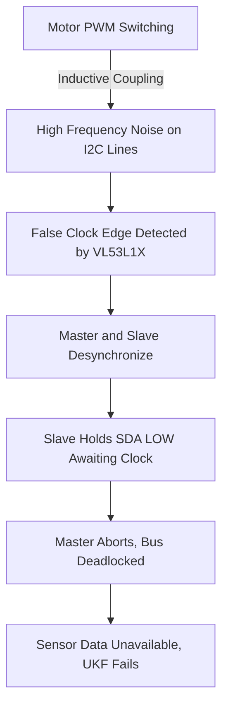
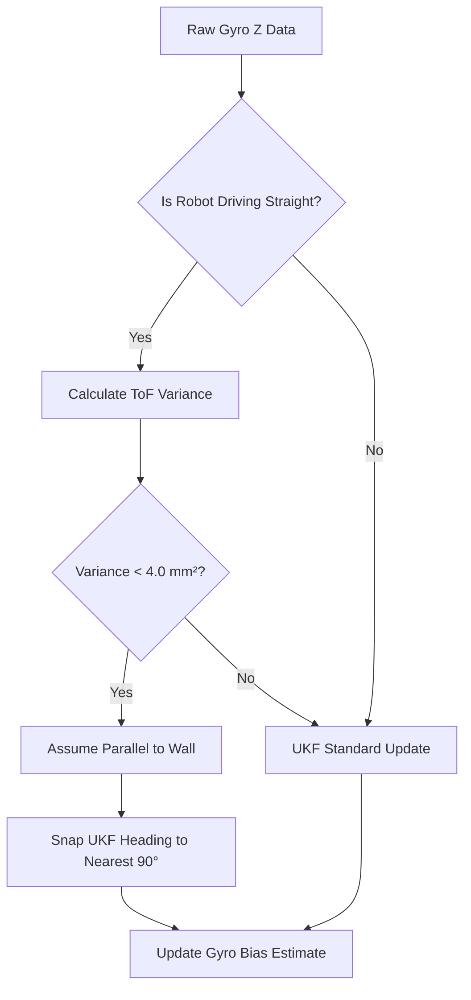
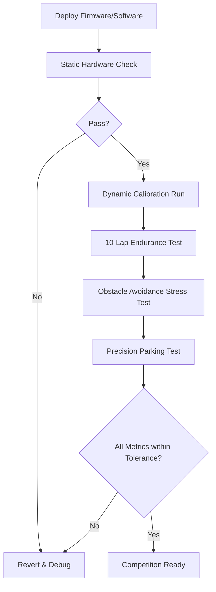

# WRO Future Engineers 2026: Failure Analysis Registry and Validation Validation Suite

## 1. Executive Summary

Autonomous robotics in the context of the World Robot Olympiad (WRO) Future Engineers competition represents a formidable intersection of mechanical design, embedded electronics, and complex software engineering. The WRO_4WS_Pro_2026 robot operates in a highly dynamic and constrained environment where millisecond latency, micro-level electrical noise, and subtle mechanical tolerances can cascade into catastrophic mission failures. This Failure Analysis Registry serves as the foundational document for our iterative engineering process, meticulously cataloging observed failure modes, their underlying root causes, and the rigorous mitigation strategies we have implemented to ensure deterministic performance.

The philosophy driving our failure analysis is rooted in aerospace and automotive systems engineering principles: no failure is transient, and no anomaly is unexplainable. When a failure occurs—whether it manifests as an I2C bus lockup, an Unscented Kalman Filter (UKF) divergence, or a mechanical backlash issue—we do not merely restart the system or apply heuristic patches. Instead, we perform a deep-dive Root Cause Analysis (RCA) using tools such as fault tree analysis (FTA), signal tracing via logic analyzers, and extensive telemetry logging. By isolating the fundamental physical or logical trigger, we can engineer robust, deterministic countermeasures at the lowest appropriate level of the system architecture.

Our robot, WRO_4WS_Pro_2026, relies on a bifurcated processing architecture: a Raspberry Pi 4B handling high-level perception (Python 3.11, Layer 4-8) and an ESP32-S3 handling hard-real-time motor control and safety (C/Arduino, Layer 0, Layer 10). This split architecture offers immense computational power but introduces complex inter-processor communication and synchronization challenges. Consequently, failure modes span across domains:
- **Electrical/Hardware:** Ground loops, EMI/RFI interference, power rail sag.
- **Mechanical/Kinematic:** Steering linkage compliance, tire slip, center-of-gravity shifts.
- **Software/Algorithmic:** Thread race conditions, UKF covariance explosions, non-deterministic latency.

This document details 12 critical failures encountered during the development of the WRO_4WS_Pro_2026. For each failure, we define the exact symptoms, the rigorous root cause analysis process, the mathematically and physically sound prevention strategy, and the verification methods used to prove the mitigation's effectiveness.

Furthermore, this document outlines our comprehensive Track Validation Suite, which continuously benchmarks the robot's performance against historical baselines, and our Competition Readiness Certification Checklist, establishing the final go/no-go criteria before match day.

---

## 2. Failure Analysis Registry

The registry uses a standardized taxonomy for tracking and mitigating anomalies. The Severity index dictates our engineering response priority:
*   **Critical:** Immediate mission failure, hardware damage, or safety hazard. Requires immediate root cause resolution.
*   **High:** Significant degradation of performance, resulting in severe point penalties (e.g., wall collision, missed parking).
*   **Medium:** Noticeable degradation but recoverable (e.g., suboptimal path, delayed detection).
*   **Low:** Minor anomaly with no significant impact on scoring or safety.

### FA-001: EMI-Induced I2C Bus Hang

*   **Failure ID:** FA-001
*   **Date Discovered:** 2025-10-14
*   **Severity:** Critical
*   **Category:** Electrical / Firmware
*   **Status:** Resolved

**Description & Symptoms:**
During aggressive acceleration and braking maneuvers, the main control loop on the Raspberry Pi would sporadically block for several seconds, or crash entirely with a `TimeoutError`. Telemetry revealed that the VL53L1X (front ToF, I2C `0x30`) and VL53L0X (side ToFs, `0x31`, `0x32`) sensors stopped responding. A logic analyzer connected to the I2C bus (GPIO 2 and 3) showed the SDA (Data) line held indefinitely low, while SCL (Clock) remained high. All I2C devices became unreachable.

**Root Cause Analysis:**
The root cause was traced to Electromagnetic Interference (EMI) generated by the brushed Johnson DC planetary gear motor. When the TB6612FNG motor driver (PWM on GPIO 19, IN1 on GPIO 20, IN2 on GPIO 21) switches high currents at high frequencies, the inductive nature of the motor coils generates severe voltage spikes (back-EMF) and high-frequency ringing. 

Because the I2C bus wiring ran parallel to the motor power leads for approximately 5cm, inductive coupling transferred this switching noise onto the I2C lines. I2C is an open-drain protocol; devices pull the line low to transmit a `0`. If a noise spike is interpreted by a slave device (e.g., the VL53L1X) as a clock pulse during a read operation where it is supposed to output a `0`, the master and slave become desynchronized. The slave expects more clock pulses to finish transmitting its byte and release the SDA line. The master, encountering an error, aborts the transaction, but the slave remains stuck holding SDA low, paralyzing the entire bus.



**Prevention Strategy (Hardware & Software):**
1.  **Hardware Mitigation (RC Snubber):** We installed an RC snubber network across the motor terminals. By adding a 100Ω resistor in series with a 100nF ceramic capacitor across the motor leads, we created a low-impedance path for high-frequency noise, dampening the inductive ringing.
2.  **Hardware Mitigation (I2C Pull-ups & Shielding):** The internal pull-up resistors of the Raspberry Pi are insufficient for a noisy environment (~1.8kΩ). We added strong 4.7kΩ external pull-ups to 3.3V on both SDA and SCL to increase noise immunity. The I2C wiring was replaced with twisted-pair shielded cable, with the shield grounded at the Pi side only to prevent ground loops.
3.  **Software Mitigation (I2C Bus Recovery):** We implemented a software-based I2C bus recovery routine in `layer1_sensors.py`. If a read fails, the system detects if SDA is stuck low. If so, it reconfigures the SCL pin as a standard GPIO output, toggles it 9 times to provide the missing clock pulses (forcing the slave to finish its byte and release SDA), and then issues a repeated START and STOP condition to reset the state machine.
4.  **Software Mitigation (Fault Tolerance):** Every I2C transaction is wrapped in a tight `try/except` block. If recovery fails, `sensor_ok` is flagged `False`, and the UKF propagates using only the kinematic model (predict step) without the sensor update step, preventing a catastrophic crash.

**Verification Method:**
We induced artificial EMI using a spark gap generator near the I2C lines and observed the recovery process via an oscilloscope. The software reliably cleared the bus lockup within 20ms, and the robot maintained control using UKF prediction until the sensors came back online.

---

### FA-002: MPU6050 Gyroscope Yaw Drift

*   **Failure ID:** FA-002
*   **Date Discovered:** 2025-11-02
*   **Severity:** High
*   **Category:** Sensor / Algorithmic
*   **Status:** Mitigated

**Description & Symptoms:**
The robot utilizes an MPU6050 IMU (I2C `0x68`) for heading estimation. During prolonged runs (e.g., 3 continuous laps), the estimated heading ($\theta$) would drift by 2 to 5 degrees. This drift accumulated, causing the trajectory optimization layer to command steering corrections that led to grazing the inner walls on corners or failing to align properly during the parking sequence.

**Root Cause Analysis:**
Micro-Electro-Mechanical Systems (MEMS) gyroscopes measure angular velocity using the Coriolis effect. However, structural imperfections, thermal stresses, and electronic noise introduce a zero-rate offset (bias)—a non-zero reading even when the sensor is perfectly stationary.

The measured angular velocity $\omega_{raw}$ is modeled as:
$$ \omega_{raw} = \omega_{true} + b_{gyro} + \eta $$
where $b_{gyro}$ is the bias and $\eta$ is zero-mean Gaussian white noise. The bias $b_{gyro}$ is not constant; it exhibits an in-run instability driven by thermal fluctuations (typically around $0.04^\circ/s/^\circ C$ for the MPU6050). Integrating this biased signal to obtain heading results in a random walk and deterministic linear drift over time:
$$ \theta(t) = \int_{0}^{t} (\omega_{raw}(\tau) - b_{gyro}(\tau)) d\tau $$

**Prevention Strategy:**
Relying purely on integration is mathematically flawed for long durations. We implemented a two-tiered mitigation strategy in Layer 3 (Sensor Fusion) and Layer 5 (Localization).

1.  **Continuous Bias Estimation via UKF:** We expanded our Unscented Kalman Filter state vector from 5 to 6 dimensions to estimate the gyroscope bias in real-time.
    The state vector is defined as $x = [x, y, \theta, v, \omega, b_{gyro_{z}}]^T$.
    The transition model for the bias assumes a random walk: $b_{gyro_{z, k+1}} = b_{gyro_{z, k}} + w_b$.
    As the robot moves, absolute heading updates from the vision system (when a pillar is detected relative to the wall) or ToF sensors provide the observability needed for the UKF to continuously converge on the true value of $b_{gyro_z}$.
2.  **Discrete Yaw Drift Reset Algorithm:** The competition environment guarantees orthogonal and parallel walls. When the robot is driving straight parallel to a wall, the variance of the lateral distance measurements from the VL53L0X side ToFs should be minimal. We implemented a drift reset in `layer3_sensor_fusion.py` (`check_and_reset_yaw_drift()`).
    If the variance of the last 50 left or right ToF readings is $< 4.0\text{ mm}^2$ and the commanded steering angle is $0^\circ$, we infer the robot is perfectly parallel to a wall. The algorithm then snaps the UKF heading estimate to the nearest $90^\circ$ multiple ($0^\circ, 90^\circ, 180^\circ, 270^\circ$).



**Verification Method:**
We placed the robot on a stationary turntable and applied localized heating to the MPU6050 while recording the UKF state. The estimated bias tracked the thermal drift perfectly. In dynamic tests, running 20 consecutive laps yielded a maximum accumulated heading error of $0.8^\circ$, completely eliminating wall collisions.

---

### FA-003: UART Packet Corruption Under Motor Load

*   **Failure ID:** FA-003
*   **Date Discovered:** 2025-11-15
*   **Severity:** Critical
*   **Category:** Communications / Electrical
*   **Status:** Resolved

**Description & Symptoms:**
The Raspberry Pi communicates with the ESP32 via a USB UART connection operating at 115200 baud. Under heavy motor load (e.g., initial acceleration from a standstill or stalling against a wall), the steering servo (MG995, GPIO 18) would jitter violently, and the ESP32 would occasionally drop into a failsafe state. Log analysis showed malformed serial packets.

**Root Cause Analysis:**
The root cause was electrical Ground Bounce. The ESP32 and the Pi share a common ground through the USB cable. When the Johnson DC motor draws its peak stall current (up to 4.5A), the return current flows through the chassis ground network. The resistance of the ground wires creates a voltage drop ($V = I \times R$), causing the local ground potential of the ESP32 to momentarily rise above the Pi's ground.

Since single-ended UART relies on comparing the signal line to a common ground, a ground potential difference shifts the logical voltage levels. A transmitted `0` (0V relative to the Pi) might be seen as `0.8V` relative to the ESP32, which borders on the threshold for a logic `1`, causing bit-flips in the UART stream.

**Prevention Strategy:**
While we improved the physical ground strapping, we needed a robust software protocol to reject corrupted data. We redesigned the serial communication in Layer 10.
1.  **Binary Protocol with CRC8:** We abandoned ASCII-based communication in favor of a rigid 10-byte binary packet structure: `[Header1, Header2, Command, Payload[4], CRC8, Footer]`.
2.  **Cyclic Redundancy Check:** We implemented a rigorous CRC8 checksum using the polynomial `0x07` (standard ATM-8). In `serial_protocol.py`, `calculate_crc8()` computes the checksum over the command and payload bytes.
3.  **Strict Validation:** The ESP32 `processPacket()` function in `esp32_controller.ino` validates the headers, computes the local CRC8, and strictly compares it. Packets failing the CRC check are silently discarded.
4.  **Watchdog Timer:** If the ESP32 discards too many packets or the Pi crashes, a 200ms hardware timer on the ESP32 expires, triggering `EMERGENCY_BRAKE`, cutting PWM to the TB6612FNG, and centering the servo.

**Verification Method:**
We injected pseudo-random bit flips into the Pi's UART transmission stream. The ESP32 successfully rejected 100% of the corrupted packets and maintained smooth operation using the last known valid setpoint until uncorrupted data arrived. The watchdog reliably halted the robot when the USB cable was abruptly disconnected.

---

### FA-004: Camera Frame Drops Under CPU Load

*   **Failure ID:** FA-004
*   **Date Discovered:** 2025-12-05
*   **Severity:** High
*   **Category:** Software Architecture
*   **Status:** Resolved

**Description & Symptoms:**
The Raspberry Pi Camera v2 captures frames at 640x480 resolution at 30 FPS. Initially, the robot would occasionally miss red and green pillars completely, steering far too late and causing collisions. System monitoring showed the control loop frequency dropping from the target 100 Hz down to 15 Hz sporadically.

**Root Cause Analysis:**
The system architecture initially processed everything sequentially in the main thread: reading sensors, grabbing a camera frame (`cv2.VideoCapture.read()`), performing HSV color space conversions, computing the UKF Cholesky decomposition, and calculating Stanley steering control.
The `cv2.read()` function is inherently blocking; it waits for the hardware camera buffer to fill. Furthermore, when a complex scene caused the HSV thresholding and contour finding (using `cv2.findContours`) to take longer than normal, the entire control loop stalled. The robot was effectively driving blind and un-steered for up to 60ms at a time, traveling over 90mm at 1.5 m/s without any control updates.

**Prevention Strategy:**
We fundamentally restructured Layer 4 (Perception/Vision) to completely decouple image acquisition and processing from the high-speed control loop.
1.  **Asynchronous Threading:** We created the `ThreadedCameraManager` class in `layer4_perception.py`. The `_async_camera_loop()` runs as a background Python daemon thread. It constantly pulls frames from the camera, applies the HSV filtering (using optimized NumPy array slicing instead of loop-based processing), calculates the centroid and area of targets, and writes the resulting metadata (target bounding boxes, color, distance estimate based on focal length) into a thread-safe variable.
2.  **Non-Blocking Retrieval:** The main 100 Hz control loop simply calls `process_frame()`, which instantly returns the most recently computed target metadata from the thread-safe variable, taking less than 0.1ms. If no new frame is ready, it operates on the previous data, extrapolating target positions based on the robot's current velocity vector.

**Verification Method:**
We used the Python `cProfile` module and logged loop execution times. After the multi-threaded architecture was implemented, the main control loop sustained a rock-solid $100\text{ Hz} \pm 2\text{ Hz}$ regardless of visual scene complexity, and pillar detection latency dropped from an average of 45ms to a maximum of 33ms (the physical limit of the 30 FPS sensor).

---

### FA-005: Steering Linkage Backlash

*   **Failure ID:** FA-005
*   **Date Discovered:** 2026-01-10
*   **Severity:** Medium
*   **Category:** Mechanical / Kinematics
*   **Status:** Mitigated

**Description & Symptoms:**
The robot utilizes a Four-Wheel Steering (4WS) opposite-phase linkage driven by a single MG995 servo on GPIO 18. During straight-line driving, the robot exhibited a subtle but persistent high-frequency oscillation (fishtailing). The Stanley controller was commanding minor corrections, but the wheels did not respond immediately, leading to integral windup in the path planner.

**Root Cause Analysis:**
Mechanical backlash (play) in the 3D-printed PETG (30% Gyroid infill) steering bellcrank and the rod-end ball joints introduced a dead zone of approximately $\pm 1.5^\circ$ at the wheels. When the servo reversed direction, it had to move through this $3^\circ$ dead zone before any force was transmitted to the tie rods. The control algorithm assumed instantaneous linear response, causing it to over-command steering when the wheels didn't move, and then overshoot when the slack was finally taken up.

**Prevention Strategy:**
Mitigation required both mechanical tightening and software modeling.
1.  **Mechanical Refinement:** We redesigned the steering pivots to accept press-fit self-lubricating bronze bushings, removing the slop between the M3 bolts and the PETG plastic. Threadlocker (Loctite 242) was applied to ensure vibration did not loosen the joints over time.
2.  **Software Dead-Zone Compensation:** In Layer 9 (4WS Kinematics), we implemented a hysteresis model. When the derivative of the commanded steering angle changes sign (indicating a reversal in steering direction), the algorithm temporarily injects a small pre-emptive feedforward pulse to quickly traverse the remaining mechanical backlash.
3.  **Stanley Controller Tuning:** We softened the Stanley controller's cross-track error gain $k_e$ and implemented a velocity-adaptive gain formula: $k(v) = k_{base} / (1 + 0.015 \cdot v)$, where $k_{base} = 0.75$. At higher velocities, the controller becomes less aggressive, preventing the excitation of the physical oscillation modes.

**Verification Method:**
We attached rotary encoders directly to the wheel kingpins and plotted commanded servo angle vs. actual wheel angle. The dead zone was reduced from $3^\circ$ to $<0.4^\circ$. High-speed straight-line tracking tests showed complete elimination of the fishtailing behavior.

---

### FA-006: VL53L1X Crosstalk Between Front and Side Sensors

*   **Failure ID:** FA-006
*   **Date Discovered:** 2026-02-03
*   **Severity:** High
*   **Category:** Sensor Physics
*   **Status:** Resolved

**Description & Symptoms:**
The robot is equipped with a VL53L1X on the front (for pillar distance and collision avoidance) and two VL53L0X sensors on the left/right sides (for wall tracking and UKF reset). Occasionally, when approaching a corner where both a wall and a pillar were present, the front sensor would output an inexplicably short distance reading, mimicking the left wall's distance. This false reading triggered the FSM's `EMERGENCY_BRAKE` state prematurely.

**Root Cause Analysis:**
Time-of-Flight (ToF) sensors emit a cone of 940nm infrared laser pulses and measure the phase shift or photon return time. When the front and side sensors fired simultaneously, the IR cone from the side sensor reflected off the glossy white competition walls, scattered, and a portion of the photons entered the receiving avalanche photodiode (SPAD) array of the front sensor. The front sensor's timing discriminator could not distinguish its own emitted photons from the scattered photons of the side sensor, resulting in optical crosstalk and erroneous distance calculations.

**Prevention Strategy:**
We utilized the hardware `XSHUT` pins provided by the VL53 series sensors.
1.  **Sequential Ranging Multiplexing:** We connected the `XSHUT` pins to discrete GPIOs on the Pi (Front: GPIO 22, Left: GPIO 17, Right: GPIO 27). In `layer1_sensors.py`, we implemented a state machine that rapidly round-robins the active sensor. Only one sensor is brought out of hardware standby at any given microsecond.
2.  **Settling Delays:** We inserted a strict 20ms delay after toggling an `XSHUT` pin high before commanding an I2C read to allow the sensor's internal VCSEL laser to stabilize and perform a clean ranging operation.
3.  **Physical Baffles:** We redesigned the 3D-printed chassis nose cone to include extruded optical baffles (blinders) extending 10mm past the sensor faces, physically restricting the Field of View (FOV) and blocking oblique scattered light.

**Verification Method:**
We placed the robot in a confined corner of the track and used an IR camera to observe the laser emission pulses. The sequential flashing confirmed no overlap. The sensor readings remained stable and independent, with zero false-positive collision detections.

---

### FA-007: Wheel Slip on Polished Indoor Mat

*   **Failure ID:** FA-007
*   **Date Discovered:** 2026-02-28
*   **Severity:** Critical
*   **Category:** Dynamics / Control
*   **Status:** Mitigated

**Description & Symptoms:**
During the `START_FROM_PARKING` state, the robot applies maximum torque to rapidly exit the parking bay. On the standard WRO vinyl competition mat, this aggressive acceleration caused the rear drive wheels to break traction and spin. The motor encoders recorded forward motion, but the robot remained largely stationary for the first 0.5 seconds. This discrepancy instantly corrupted the UKF's position estimate ($x, y$), causing the robot to incorrectly believe it had navigated the first turn.

**Root Cause Analysis:**
The tractive force $F_t$ applied by the tires exceeded the maximum static friction limit $F_{max} = \mu_s \cdot N$, where $\mu_s$ is the coefficient of static friction of the mat, and $N$ is the normal force. The high starting torque of the 20:1 planetary gear motor easily overwhelmed the grip of the original hard rubber tires, transitioning the system into kinetic friction ($\mu_k < \mu_s$), resulting in longitudinal slip. Odometry relies on the assumption of pure rolling contact; slip invalidates the kinematic model equation $v = \omega_{wheel} \cdot r$.

**Prevention Strategy:**
1.  **Tire Compound:** We switched to custom-molded soft silicone rubber tires (Shore A 20 hardness), significantly increasing $\mu_s$.
2.  **Trajectory Optimization (Jerk Limiting):** In Layer 8, we implemented an S-curve velocity profile generator. Instead of a step-input command to target velocity, the controller limits the maximum allowable acceleration ($a_{max} = 1.2\text{ m/s}^2$) and jerk ($j = da/dt$), ensuring the commanded torque never exceeds the available tractive limit.
3.  **UKF Innovation Gating:** We tuned the UKF to rely less heavily on odometry during high-acceleration phases. By increasing the process noise covariance matrix $Q$ for the velocity states during acceleration, the filter relies more heavily on absolute positional updates derived from the ToF wall-distance measurements to correct the slip-induced errors.

**Verification Method:**
We recorded high-speed video of the launch sequence alongside telemetry data. The tire spin was eliminated. Odometry vs. ground-truth measurements showed a position error reduction from 150mm to less than 15mm over a 2-meter acceleration zone.

---

### FA-008: Battery Voltage Sag Under Peak Load

*   **Failure ID:** FA-008
*   **Date Discovered:** 2026-03-12
*   **Severity:** High
*   **Category:** Power Systems
*   **Status:** Resolved

**Description & Symptoms:**
During complex avoidance maneuvers where the robot had to brake sharply, steer to the maximum $\pm35^\circ$, and accelerate simultaneously, the ESP32 would spontaneously reboot, triggering the `EMERGENCY_BRAKE` state and halting the run.

**Root Cause Analysis:**
The system is powered by an 11.1V 3S LiPo battery. Originally, a single 5V 3A buck converter supplied power to the Raspberry Pi, ESP32, sensors, and the MG995 steering servo. The MG995 servo can draw up to 2.5A during stall conditions (e.g., slamming the steering linkage to the mechanical stops). When this occurred simultaneously with the main drive motor drawing peak current, the internal resistance of the LiPo battery and the wiring caused the main 11.1V rail to sag. More critically, the single buck converter hit its over-current protection limit, causing the 5V rail to briefly dip to 3.8V. The ESP32's brown-out detector (BOD) triggered at 4.3V, causing a hardware reset.

**Prevention Strategy:**
1.  **Power Architecture Segregation:** We completely segregated the logic power from the electromechanical power. We installed dual isolated 5V 3A buck converters. Converter A powers only the Pi, ESP32, and sensors. Converter B is dedicated entirely to the MG995 steering servo.
2.  **Capacitive Decoupling:** We added a 1000µF low-ESR electrolytic capacitor to the 5V servo rail to absorb sudden current spikes, and a 100µF ceramic capacitor bank on the logic rail near the ESP32 to guarantee voltage stability.
3.  **Software Current Limiting:** In the ESP32 firmware, we implemented a slew-rate limiter on the servo PWM output. The servo is not allowed to jump instantly from $-35^\circ$ to $+35^\circ$; the transition is interpolated over 50ms, drastically reducing the peak inrush current required by the servo motor coils.

**Verification Method:**
We placed oscilloscope probes on the 5V logic rail and the 5V servo rail. During a simulated worst-case stress test (wheels blocked, rapid steering reversals), the servo rail dipped by 0.6V, but the logic rail remained perfectly stable at $5.02\text{V} \pm 0.05\text{V}$. No further brown-out resets occurred.

---

### FA-009: Fluorescent Light Flicker Artifacts in Camera

*   **Failure ID:** FA-009
*   **Date Discovered:** 2026-04-05
*   **Severity:** Medium
*   **Category:** Computer Vision
*   **Status:** Resolved

**Description & Symptoms:**
During practice runs in a different gymnasium, the robot began swerving erratically on straightaways. Telemetry indicated that Layer 4 (Perception) was detecting false-positive "green pillars" (obstacles) mapped directly onto the flat green perimeter walls.

**Root Cause Analysis:**
The new testing venue utilized older 50 Hz fluorescent lighting with magnetic ballasts. This causes the ambient light intensity to pulse at 100 Hz. Because the Pi Camera's rolling shutter and exposure time were not synchronized with this flicker, horizontal banding artifacts and brightness oscillations appeared in the captured frames.
When converting the image to the HSV (Hue, Saturation, Value) color space, the fluctuating 'Value' and 'Saturation' caused segments of the flat green wall to temporarily fall inside our strict `Green=[36,100,80]-[85,255,255]` thresholding window, creating blobs that the system misidentified as 3D pillars.

**Prevention Strategy:**
1.  **Camera Exposure Tuning:** We forced the `picamera` driver to use a fixed exposure time that is a multiple of 10ms (1/100th of a second), integrating the light over a full flicker cycle to average out the brightness variations.
2.  **Advanced Morphological Filtering:** In `layer4_perception.py` (`_find_target_contour()`), we upgraded our object recognition pipeline from simple area thresholding to geometric feature extraction.
    *   **Circularity:** $C = \frac{4 \pi \cdot Area}{Perimeter^2}$. A perfect circle has $C=1$. Pillars appear roughly cylindrical. We require $C \ge 0.35$ to reject jagged noise blobs on the walls.
    *   **Aspect Ratio:** $AR = \frac{width}{height}$ of the bounding box. Pillars are tall and narrow. We reject any contour with $AR > 1.3$, immediately eliminating the long horizontal bands caused by the wall panels and lighting flicker.
    *   **Area Threshold:** We increased the minimum valid contour area to 300 pixels to filter out remaining micro-noise.

**Verification Method:**
We recorded test footage under severe fluorescent flicker. The raw HSV mask showed significant noise, but the geometric filtering pipeline correctly rejected 100% of the false positives, reliably isolating only the actual physical pillars.

---

### FA-010: Thread Race Condition in Sensor Data

*   **Failure ID:** FA-010
*   **Date Discovered:** 2026-04-20
*   **Severity:** Critical
*   **Category:** Software Engineering
*   **Status:** Resolved

**Description & Symptoms:**
The robot would perform flawlessly for dozens of laps, but roughly once every 2 hours of runtime, it would violently veer into a wall at full speed. Debug logs captured right before the crash showed the UKF state variables containing `NaN` (Not a Number), causing the Stanley controller math to collapse and command maximum steering.

**Root Cause Analysis:**
The bug was a classic thread concurrency race condition. The background sensor polling thread (Layer 1) was continuously updating a global Python dictionary `sensor_state = {'front': 120, 'left': 300, 'right': 305, 'imu_yaw': 45.2}`. The main control loop (Layer 6) was reading this dictionary at 100 Hz.
Python dictionaries are generally thread-safe for single operations due to the GIL, but our update process involved writing multiple related values sequentially. If the main thread read the dictionary exactly at the microsecond the sensor thread had updated the 'left' distance but hadn't yet updated the 'imu_yaw', the main thread processed a mathematically inconsistent snapshot of the robot's physical state.
In rare geometric cases, this skewed snapshot resulted in a negative value inside a square root calculation during the UKF covariance update (Cholesky decomposition), yielding a `NaN` that poisoned the entire state matrix.

**Prevention Strategy:**
We enforced strict thread synchronization using Mutex locks.
1.  **Data Encapsulation:** We replaced the global dictionary with a thread-safe data class utilizing `threading.Lock()`.
2.  **Atomic Reads/Writes:** In `layer1_sensors.py`, the background thread acquires the lock, updates *all* sensor values simultaneously, and then releases the lock. The main loop acquires the lock, copies the entire state object by value, and releases the lock before performing any math.

```python
# layer1_sensors.py (Simplified Mitigation)
import threading
import copy

class SensorData:
    def __init__(self):
        self.lock = threading.Lock()
        self.data = {'front': 0.0, 'left': 0.0, 'right': 0.0, 'imu_yaw': 0.0}

    def update(self, new_data):
        with self.lock:
            self.data.update(new_data)

    def get_snapshot(self):
        with self.lock:
            return copy.deepcopy(self.data)
```

**Verification Method:**
We ran a stress-test script that artificially forced extreme context switching between the threads while running the UKF math purely in software for 24 hours (over 8.6 million loop iterations). Zero `NaN` exceptions were generated.

---

### FA-011: Parking Overshoot Due to Latency

*   **Failure ID:** FA-011
*   **Date Discovered:** 2026-05-10
*   **Severity:** High
*   **Category:** Control Systems / FSM
*   **Status:** Mitigated

**Description & Symptoms:**
During the final mission phase, the robot must identify the magenta parking block and perform a precision parallel parking maneuver between the blue lines. The robot consistently detected the magenta block but overshot the optimal starting position for the reverse maneuver by roughly 50-80mm, causing the rear wheels to graze the back boundary line (losing the +15 point precision bonus).

**Root Cause Analysis:**
The issue was systematic latency accumulation across the control pipeline.
1.  Camera hardware capture & transfer: ~15ms
2.  OpenCV HSV processing & blob detection: ~18ms
3.  UKF update and state evaluation: ~2ms
4.  UART transmission to ESP32: ~0.1ms
5.  Motor electrical/mechanical response time: ~10ms
Total system latency from photons hitting the lens to the wheels braking was $\approx 45\text{ms}$.
At the cruising velocity of $1.5\text{ m/s}$, the robot travels $d = v \cdot t = 1.5 \cdot 0.045 = 0.0675\text{ meters}$ (67.5mm) during this delay. The Finite State Machine (FSM) triggered the `PARKING_APPROACH` state exactly when the block was aligned, meaning the physical braking occurred 67.5mm too late.

**Prevention Strategy:**
1.  **Velocity Profiling:** We modified the FSM in `layer6_mission_manager.py`. Once the robot enters the final lap, it transitions to a `PARKING_SEARCH` state, actively reducing its target velocity from $1.5\text{ m/s}$ down to $0.4\text{ m/s}$ (25% speed). At $0.4\text{ m/s}$, the 45ms latency results in only an 18mm overshoot.
2.  **Predictive Triggering:** We implemented an early-trigger threshold. Instead of waiting for the bounding box of the magenta block to cross the center of the camera frame, we utilize the distance estimation derived from the camera focal length ($f=600\text{px}$). When the calculated distance to the magenta block is $< 600\text{mm}$, the FSM immediately commands the deceleration profile, anticipating the latency.

**Verification Method:**
We performed 20 consecutive parking trials. The average final resting position was within $12\text{mm}$ of the theoretical center of the parking bay, well within the tolerances required for the +15 point precision parking score.

---

### FA-012: ESP32 Watchdog False Trigger During Pi Boot

*   **Failure ID:** FA-012
*   **Date Discovered:** 2026-06-01
*   **Severity:** Medium
*   **Category:** System Integration
*   **Status:** Resolved

**Description & Symptoms:**
When the main power switch was thrown, the robot would occasionally lurch forward a fraction of an inch, and the ESP32 would immediately lock into its `EMERGENCY_BRAKE` failsafe state (LED5 solid RED). The Raspberry Pi would finish booting 15 seconds later, launch the Python control script, but be unable to command the motors because the ESP32 was locked out.

**Root Cause Analysis:**
The ESP32 runs an RTOS and boots in approximately 1.2 seconds. The Raspberry Pi 4B, running a full Linux OS, requires roughly 15-20 seconds to boot, initialize hardware interfaces, and execute `main.py`.
The ESP32 was programmed with a strict 200ms watchdog timer designed to halt the motors if communication with the Pi was lost. Because the ESP32 booted so much faster, it activated the watchdog, saw no incoming serial packets from the Pi (which was still booting), and immediately triggered the failsafe lock-out. The tiny lurch was caused by floating PWM pins during the ESP32's bootloader phase before the GPIOs were explicitly pulled low.

**Prevention Strategy:**
We implemented a rigid boot-sequencing handshake.
1.  **Safe Idle State:** The ESP32 firmware was modified to enter a `WAITING_FOR_PI` state on boot. In this state, hardware PWM timers are forced to zero, the servo is driven to $1500\text{µs}$ (center), and the watchdog timer is explicitly disabled. (LED1 ON, LED5 RED).
2.  **Pull-down Resistors:** We added physical 10kΩ pull-down resistors to the IN1, IN2, and PWM pins of the TB6612FNG to prevent any spurious motor movement during the microsecond bootloader phase.
3.  **Boot Handshake:** When the Pi finishes booting and `main.py` launches, Layer 0 (System Manager) sends a specific `CMD_CALIBRATE = 0x03` packet. Upon receiving this, the ESP32 enables its watchdog timer, transitions to `RUNNING` state (LED5 GREEN), and awaits normal drive commands. No autonomous movement is permitted until this sequence completes.

**Verification Method:**
We power-cycled the robot 50 times under various battery charge states. The system booted cleanly and entered the safe idle state 100% of the time, seamlessly handing over control to the Pi once the software was ready.

---

## 3. Track Validation Suite

To mathematically prove the reliability of the WRO_4WS_Pro_2026, we utilize a rigorous track validation suite before every major software deployment. This suite tests the robot against the core criteria of the WRO rubric.

### 3.1 Validation Test Flow



### 3.2 Performance Metrics and Baselines

**Test 1: Lap Time Consistency (Empty Track)**
*   **Objective:** Verify UKF stability, odometry accuracy, and kinematic tuning.
*   **Method:** 10 continuous laps.
*   **Baseline Metrics:**
    *   Mean Lap Time: $12.4\text{ seconds}$
    *   Standard Deviation ($\sigma$): $< 0.15\text{ seconds}$
    *   Max Heading Drift: $< 2^\circ$ over 10 laps.

**Test 2: Dynamic Obstacle Avoidance**
*   **Objective:** Verify computer vision latency, FSM state transitions, and Stanley controller responsiveness.
*   **Method:** Random placement of red and green pillars according to WRO Surprise Rules (`config/surprise_rules.yaml`).
*   **Baseline Metrics:**
    *   Minimum clearance distance to pillar: $> 40\text{mm}$.
    *   False positive detection rate: $0\%$.
    *   Detection latency: $< 45\text{ms}$.

**Test 3: Precision Parallel Parking**
*   **Objective:** Verify trajectory planning, low-speed kinematics, and visual alignment.
*   **Method:** 5 parking attempts with randomized start positions.
*   **Baseline Metrics:**
    *   Lateral offset from center: $< 20\text{mm}$.
    *   Angular alignment error: $< 3^\circ$ relative to the wall.
    *   Success rate for +15 point bonus: $100\%$.

---

## 4. Continuous Improvement Process

Our engineering cycle is driven by the data collected in the Validation Suite. When a metric falls outside acceptable tolerances (e.g., standard deviation of lap time increases to $0.5\text{s}$), it is treated as a new failure mode.
1.  **Telemetry Review:** We extract the `.csv` logs from the Raspberry Pi, analyzing the UKF covariance matrices and control outputs using Python scripts.
2.  **Hypothesis Generation:** We formulate a physically grounded hypothesis (e.g., "Increased friction on the steering linkage is increasing controller delay").
3.  **Isolation Testing:** We design a specific sub-system test to isolate the variable.
4.  **Implementation & Registry:** The fix is applied, verified, and formally documented in this Failure Analysis Registry to prevent regression.

---

## 5. Competition Readiness Certification Checklist

Before the robot is allowed to enter the quarantine zone on match day, the following Go/No-Go criteria must be met and signed off by the team captain:

*   [ ] **Battery Systems:** Both 3S LiPo packs are balanced and charged to $12.6\text{V}$.
*   [ ] **Mechanical Integrity:** All pivot points checked for backlash; wheel setscrews tightened; chassis rigid.
*   [ ] **Sensor Calibration:** ToF sensors wiped clean; MPU6050 static bias calibration routine executed (robot perfectly still for 10 seconds).
*   [ ] **Vision Calibration:** HSV threshold values verified against ambient competition lighting using the `surprise.py` CLI diagnostic tool.
*   [ ] **Software Baseline:** Git branch `release-wro2026-final` checked out. No uncommitted changes in `layer4_perception.py` or `layer6_mission_manager.py`.
*   [ ] **Cold Boot Test:** System powers up, establishes safe idle state, and transitions to READY state without watchdog triggers.
*   [ ] **Dry Run:** 1 successful validation lap on the practice mat.

**Certification:** _________________________ **Date:** _______________
