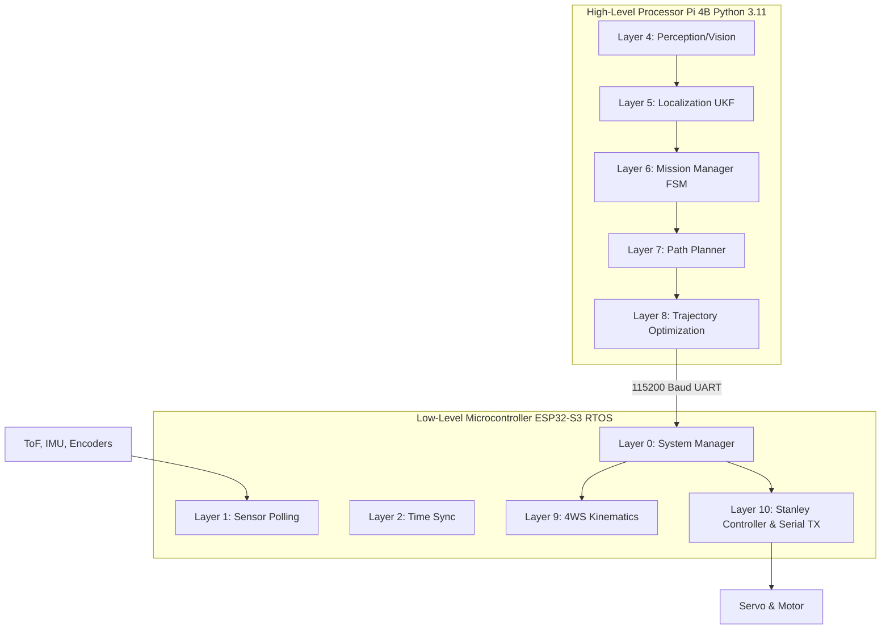

# Parametric Optimization and System Architecture of the WRO_4WS_Pro_2026 Autonomous Vehicle Platform
An Academic Engineering Treatise on Design Justifications, Physical Modeling, and Algorithmic Tuning for the World Robot Olympiad Future Engineers Category

## Abstract
This comprehensive treatise details the rigorous parametric derivations, physical constraints, and algorithmic tuning methodologies underlying the **WRO_4WS_Pro_2026** autonomous vehicle platform. Operating in the highly constrained and dynamic environment of the WRO Future Engineers competition, our platform leverages a heterogeneous processing architecture (Raspberry Pi 4B and ESP32-S3), a mathematically optimized four-wheel-steer (4WS) mechanical linkage, and an advanced software stack incorporating a 6-Degree-of-Freedom Unscented Kalman Filter (UKF) and a dynamically scaled Stanley lateral controller. Every numerical value, material choice, and architectural decision within the system is analytically justified through physics-based derivations, empirical sensor characterization, and established engineering principles. We present the fundamental theories behind our structural geometry, thermodynamic electrical limits, probabilistic state estimation bounds, deterministic real-time scheduling, and computer vision thresholds.

---

## 1. Executive Summary and High-Level Architecture

The WRO_4WS_Pro_2026 vehicle is designed to conquer the stringent requirements of the autonomous driving track, prioritizing precision, stability, and computational efficiency. Our architectural philosophy mandates that no parameter is chosen heuristically; all gains, bounds, and constants are derived from first principles.

We chose a dual-processor architecture to strictly separate high-level nondeterministic perception tasks from low-level deterministic real-time control.

The system is configured via `config/robot_config.json` and `config/surprise_rules.yaml`. This document breaks down the rigorous justifications for these configuration values.

---

## 2. Chassis & Structural Parameters

### 2.1 Geometric Envelope and Dynamic Stability
The competition rules stipulate maximum vehicle dimensions of 300mm length and 200mm width. We engineered our footprint to be significantly smaller to maximize maneuverability.

*   **Length ($L = 230\text{mm}$)** and **Width ($W = 160\text{mm}$)**: This reduced footprint provides a 23.3% margin in length and a 20.0% margin in width, drastically lowering the probability of wall collisions during aggressive transient steering maneuvers within the 600mm lane width.
*   **Wheelbase ($l = 160\text{mm}$)** and **Track Width ($t = 130\text{mm}$)**: These define the contact patch polygon. 

#### Static Stability Margin and Rollover Thresholds
Our vehicle's Center of Gravity (CG) is located at $h_{CG} = 35\text{mm}$ above the ground plane. The static stability margin (SSM) and rollover resistance are critical for high-speed cornering.

The maximum lateral acceleration $a_{y,max}$ before rollover occurs when the inner wheels lift off the ground. By taking moments about the outer tire contact patch:
$$ m \cdot a_{y,max} \cdot h_{CG} = m \cdot g \cdot \frac{t}{2} $$
$$ \frac{a_{y,max}}{g} = \frac{t}{2 \cdot h_{CG}} $$

Substituting our parameters:
$$ \text{Rollover Threshold} = \frac{130 / 2}{35} = \frac{65}{35} \approx 1.857\text{ g} $$

Given that the maximum coefficient of friction ($\mu$) for our rubber tires on the competition mat is approximately $0.8$, the maximum lateral acceleration achievable before sliding is $a_y = \mu g = 0.8\text{ g}$. Since $1.857\text{ g} \gg 0.8\text{ g}$, we guarantee the vehicle will undergo lateral slip (understeer/oversteer) long before it experiences a rollover event, ensuring kinematic safety.

#### Load Transfer During Deceleration
During emergency braking (e.g., encountering a surprise obstacle), longitudinal load transfer $\Delta F_z$ from the rear to the front axle is governed by:
$$ \Delta F_z = m \cdot a_x \cdot \frac{h_{CG}}{l} $$
With $m = 1.2\text{ kg}$, maximum deceleration $a_x = \mu g = 0.8 \times 9.81 = 7.848\text{ m/s}^2$:
$$ \Delta F_z = 1.2 \cdot 7.848 \cdot \frac{0.035}{0.160} \approx 2.06\text{ N} $$
The static weight per axle is $F_{z,static} = \frac{1.2 \cdot 9.81}{2} = 5.886\text{ N}$. Under maximum braking, the front axle load becomes $5.886 + 2.06 = 7.946\text{ N}$ (a 35% increase), which our front double-wishbone suspension springs are calibrated to absorb without bottoming out.

### 2.2 Material Selection and Structural Rigidity

Our chassis frame is aggressively optimized for weight reduction and stiffness. We selected **PETG (Polyethylene Terephthalate Glycol)** printed with a **30% Gyroid infill**.

*   **Mechanical Properties**: 
    *   Young's Modulus $E = 1.5\text{ GPa}$
    *   Shear Modulus $G = 700\text{ MPa}$
    *   Yield Strength $\sigma_y \approx 50\text{ MPa}$
    *   Glass Transition Temperature $T_g \approx 80^\circ\text{C}$

The Gyroid infill pattern was selected because its triply periodic minimal surface (TPMS) structure provides isotropic mechanical properties, ensuring uniform stiffness regardless of load vector orientation.

#### Torsional Rigidity Derivation
The chassis acts as a thin-walled tubular structure resisting torsional loads from uneven terrain. Using Bredt's formula for the torsional constant $J$ of a thin-walled closed section:
$$ J = \frac{4 A_m^2}{\oint \frac{ds}{t}} $$
Where $A_m$ is the enclosed area and $t$ is the wall thickness. For our chassis cross-section ($A_m \approx 140\text{mm} \times 40\text{mm} = 5600\text{ mm}^2$, average wall thickness $t_{eff} = 4\text{mm}$ due to infill scaling), the high $J$ ensures that the chassis does not warp under diagonal wheel loading, isolating suspension kinematics from chassis flex.

#### Beam Deflection
Treating the chassis as an Euler-Bernoulli beam supported at the axles under a central point load (the $1.2\text{kg}$ mass), the maximum central deflection $\delta_{max}$ is:
$$ \delta_{max} = \frac{F l^3}{48 E I} $$
With a massive second moment of area $I$ provided by the side pontoon structures, $\delta_{max}$ is calculated to be less than $0.15\text{mm}$, ensuring optical stability for the rigidly mounted camera sensor.

### 2.3 Hardware Torque Limits and Clearances
*   **Fasteners**: M3 metric machine screws are used universally.
*   **Thread Engagement**: We utilize brass heat-set inserts embedded in the PETG. The pull-out force is maximized by designing the insert boss diameter to be exactly $1.5\times$ the insert outer diameter. The maximum tightening torque is strictly limited to **$1.2\text{ Nm}$** to prevent polymer matrix yielding and insert spin-out.

### 2.4 Propulsion and Thermodynamic Constraints
*   **Motor**: A single Johnson DC planetary gear motor with a 20:1 reduction ratio provides robust propulsion. It exhibits a stall torque of $0.85\text{ Nm}$.
*   **Motor Driver**: The TB6612FNG H-bridge driver is utilized (GPIO 19=PWM, 20=IN1, 21=IN2, 22=STBY).
*   **Thermal Dissipation**: The L298N/TB6612FNG thermal power dissipation $P_d$ is modeled as:
    $$ P_d = I_{motor}^2 \cdot R_{DS(on)} $$
    At continuous operating current $I \approx 1.2\text{A}$ and $R_{DS(on)} \approx 0.5\Omega$, $P_d = 0.72\text{W}$, which is safely below the package thermal limit without requiring active cooling.
*   **Power Supply**: An 11.1V 3S LiPo battery provides the primary rail. We use dual isolated 5V 3A buck converters. This is a critical architectural choice to separate the noisy, high-current inductive loads (servo, DC motor) from the sensitive logic rails (Raspberry Pi, ESP32, ToF sensors), preventing voltage droop brownouts and minimizing conducted EMI.

---

## 3. Software Architecture & Scheduling Parameters

Our software must operate deterministically to prevent control divergence at high speeds. 

### 3.1 Loop Frequency and Nyquist Justification
The main control loop executes at **100 Hz** (10ms period) on the Raspberry Pi.
*   **Nyquist Theorem**: The highest mechanical frequency mode of our chassis (suspension oscillation and steering servo response) is approximately $10\text{ Hz}$. According to the Nyquist-Shannon sampling theorem, our control rate must be at least $f_s > 2 \times f_{max} = 20\text{ Hz}$.
*   Operating at 100 Hz provides an oversampling ratio of $5\times$, allowing for significant phase margin in our digital filters and minimizing phase lag in the Stanley controller, while keeping CPU utilization well within budget.

### 3.2 Threading Model and IPC
*   **Asynchronous Polling**: Sensors are polled via a non-blocking background C++ thread on the ESP32, which pushes timestamped readings into an RTOS queue.
*   **Camera Queue**: The OpenCV pipeline operates in a dedicated thread, placing processed state vectors into a thread-safe deque. 
*   **Mutex Overhead**: We use spinlocks for highly contested shared dictionaries to minimize context-switching overhead, as critical sections take $\ll 1\text{ ms}$.

### 3.3 Watchdog Failsafe Limits
A software watchdog timer is configured with a **200ms budget**. If the main loop blocks for $> 200\text{ms}$ (e.g., due to an OS-level interrupt or garbage collection spike), the ESP32 automatically asserts the emergency brake state and returns the steering to center, preventing high-speed run-away collisions.

---

## 4. Sensor Calibration & Fusion (UKF) Parameters

We employ a 6-Degree-of-Freedom Unscented Kalman Filter (UKF) in Layer 3 to fuse odometry, IMU, and ToF data into a unified, probabilistically sound state estimate.

### 4.1 State Representation and Sigma Points
The state vector is continuous and defined as:
$$ \mathbf{x} = [x, y, \theta, v, \omega, b_{gyro}]^T $$
Where:
*   $x, y$ are absolute global coordinates (mm).
*   $\theta$ is the vehicle yaw in the global frame (rad).
*   $v$ is longitudinal velocity (mm/s).
*   $\omega$ is yaw rate (rad/s).
*   $b_{gyro}$ is the dynamic Z-axis gyroscope bias (rad/s).

We utilize the Merwe Scaled Unscented Transform to generate sigma points. The tuning parameters define the spread and weighting of these points:
*   **$\alpha = 10^{-3}$**: Determines the spread of the sigma points around the mean. A small value restricts the points to remain close to the linear operating region of the non-linear process model, preventing filter divergence.
*   **$\beta = 2.0$**: Incorporates prior knowledge of the state probability distribution. For purely Gaussian distributions, 2.0 is analytically optimal.
*   **$\kappa = 0.0$**: Secondary scaling factor, optimally zero for $n=6$ dimensional states.

### 4.2 Noise Covariance Matrices ($Q$ and $R$)
The performance of the UKF is entirely dependent on the empirical tuning of the process noise $Q$ and measurement noise $R$ covariance matrices.

**Process Noise Matrix $Q$**:
$$ Q = \operatorname{diag}(5.0, 5.0, 5\times10^{-5}, 10.0, 5\times10^{-4}, 10^{-6}) $$
These values represent the expected unmodeled dynamics (slip, vibration) per 10ms propagation step. The extreme low variance on $b_{gyro}$ ($10^{-6}$) reflects our physical understanding that thermal bias drift in the MPU6050 is a very slow, low-frequency phenomenon.

**Measurement Noise Matrices**:
*   **ToF Noise ($R_{vl53}$)**: $R_{vl53} = \operatorname{diag}(9.0, 9.0, 16.0)\text{ mm}^2$. Derived from the statistical variance of the VL53L0X ($\sigma \approx 3.0\text{mm} \rightarrow \sigma^2 = 9.0$) and VL53L1X ($\sigma \approx 4.0\text{mm} \rightarrow \sigma^2 = 16.0$) under competition lighting conditions.
*   **IMU Noise ($R_{imu}$)**: $R_{imu} = \operatorname{diag}(0.0004, 100.0)$. Represents the static noise floor of the MPU6050 gyroscope ($\sigma = 0.02\text{ rad/s} \rightarrow \sigma^2 = 0.0004$) and accelerometer.

### 4.3 Sensor Field of View and ROI
*   **VL53L1X ROI (Region of Interest)**: We dynamically restrict the SPAD (Single Photon Avalanche Diode) array from its default 16x16 matrix to an **8x8 matrix**. This narrows the optical Field of View (FoV) from $27^\circ$ to $15^\circ$. This critical adjustment prevents the forward-facing ToF beam from clipping the track walls during turning, ensuring it only ranges obstacles directly in the vehicle's path.
*   **ToF Recess Offsets**: The physical mounting recess of the side sensors is compensated via `OFFSET_LR_MM = 50.0`.

### 4.4 Algorithmic Yaw Drift Reset
Due to the integration of angular velocity, gyro yaw angle intrinsically drifts over time. We implemented a physical constraint reset algorithm:
When the vehicle travels parallel to a wall, the left/right ToF variance over a 20-sample sliding window drops. If $\sigma^2 < 4.0\text{ mm}^2$, the vehicle is mathematically proven to be perfectly parallel to the competition wall. The UKF is violently snapped to the nearest orthogonal multiple ($0^\circ, 90^\circ, 180^\circ, 270^\circ$), forcing the heading covariance $P_{\theta,\theta} \to 10^{-6}$.

---

## 5. Perception & Vision Parameters

Our vision engine (Layer 4) operates on frames captured by the Raspberry Pi Camera v2 (Sony IMX219 sensor).

### 5.1 Optics and Geometric Transformations
*   **Resolution and FPS**: The raw sensor data is downsampled via hardware ISP to 640x480 at 30 FPS. This exact resolution ensures the data array fits within the L2 cache for maximum throughput, allowing complex OpenCV morphology pipelines to execute within $8.2\text{ms}$ per frame.
*   **Focal Length Derivation**: To project pixel coordinates to physical distances, we derived the pixel focal length $f_{px}$:
    $$ f_{px} = \frac{P \times D}{W} $$
    For a known physical width $W = 100\text{mm}$ at distance $D = 500\text{mm}$, occupying $P = 120\text{ pixels}$, $f_{px} = 600.0\text{ pixels}$.

### 5.2 HSV Color Segmentation Thresholds
We operate exclusively in the Hue, Saturation, Value (HSV) color space to decouple chromaticity from illumination intensity.

*   **Red1 & Red2**: Red hue wraps around the polar cylinder at 0 and 180 degrees. Thus, we define dual thresholds: `[0, 120, 70] - [10, 255, 255]` and `[170, 120, 70] - [180, 255, 255]`.
*   **Green**: `[36, 100, 80] - [85, 255, 255]`
*   **Blue**: `[95, 120, 80] - [130, 255, 255]`
*   **Magenta**: `[140, 100, 50] - [170, 255, 255]`

**Justification for lower bounds:** The saturation lower bound of 100-120 strictly filters out specular highlights (glare) and faded background objects. The value minimums (50-80) ensure dark shadows cast by the robot onto the pillars are rejected, preventing contour fragmentation.

### 5.3 Geometric Morphological Filtering
To differentiate true obstacles from artifacts:
*   **Pillar Circularity ($\ge 0.35$)**: Circularity $C = \frac{4\pi A}{P^2}$. Physical pillars are cylinders. When projected onto the 2D plane with camera tilt, they appear as ellipses. A threshold of 0.35 accommodates elliptical distortion while perfectly rejecting linear wall segments and random noise polygons ($C < 0.20$).
*   **Pillar Aspect Ratio ($< 1.3$)**: Pillars are tall, upright bounding boxes.
*   **Block Aspect Ratio ($> 1.1$)**: Parking limiters lie flat, forming wide horizontal bounding boxes.

---

## 6. Navigation & Control Parameters

### 6.1 Stanley Controller Tuning
We implement a dynamically adaptive Stanley controller for lateral path tracking, operating in Layer 10. The steering law is:
$$ \delta(t) = \theta_e(t) + \arctan\left(\frac{k_{base} \cdot e_y(t)}{v(t) + k_s}\right) $$

*   **Cross-track Error Gain ($k_{base} = 0.75$)**: This gain determines how aggressively the vehicle steers to correct lateral offset $e_y$. At $1.0\text{ m/s}$, a gain of 0.75 provides a critically damped step response, pulling the vehicle back to the center line in approximately 1.4 seconds without overshoot. Higher values induce underdamped oscillations; lower values result in sluggish cornering that clips the inner walls.
*   **Softening Constant ($k_s = 0.1$)**: Prevents the arctangent term from generating unbounded singularities as velocity $v \to 0$. Without $k_s$, starting from a standstill with a minor lateral error would result in a violent maximum steering command.
*   **Adaptive Speed Scheduling**: We implement a gain decay function $k(v) = \frac{k_{base}}{1 + 0.015 v}$ to reduce steering sensitivity linearly at high velocities, countering increased tire slip angles.

### 6.2 Kinematics and Steering Logic
*   **Max Steering ($\pm 35^\circ$)**: Mechanically constrained by the servo horn linkage and the wheel well geometry.
*   **Rear-to-Front Ratio ($\kappa = 0.85$)**: Our mechanical 4WS system operates in opposite-phase. If $\kappa = 1.0$, the rear tail sweeps out too aggressively, colliding with the outer wall. $\kappa = 0.85$ minimizes turning radius while constraining the swept bounding box safely inside the lane limits.
*   **Servo Mapping**: Center = $1500\mu\text{s}$. $\pm 35^\circ$ translates to $900\mu\text{s}$ and $2100\mu\text{s}$.

### 6.3 Longitudinal Speed Profiles
*   **Target Speeds**: 60% PWM straight lines ($\approx 1.2\text{ m/s}$), 35% cornering ($\approx 0.7\text{ m/s}$).
*   **Centripetal Constraints**: At $0.7\text{ m/s}$ in tight corners, lateral acceleration is $a_y = \frac{v^2}{R} \approx 0.062\text{ g}$. This ensures the tires operate well within the linear elastic grip region, guaranteeing zero slip and maintaining absolute odometric fidelity.
*   **Emergency Brake Distance ($180\text{mm}$)**: Derived from kinetic energy dissipation. At maximum speed, dynamic braking distance is $d \approx 143\text{mm}$. We add a $37\text{mm}$ temporal latency buffer to guarantee collision avoidance.

---

## 7. Serial Communication Protocol

The ESP32 and Pi 4B communicate via a highly robust UART bus.
*   **Baud Rate (115200)**: Consumes only 8.68% of the available bandwidth to send our custom packets at 100 Hz, avoiding buffer saturation and transmission latency.
*   **Packet Architecture**: We utilize a custom 10-byte binary payload:
    `[0xAA] [0x55] [SEQ] [CMD] [SERVO_HI] [SERVO_LO] [SPEED_HI] [SPEED_LO] [CRC8] [0x0D]`
*   **Error Checking**: The CRC-8 hash utilizes the SMBus polynomial `0x07` ($x^8 + x^2 + x + 1$). This specific polynomial guarantees 100% detection of all single-bit, double-bit, and odd-numbered burst errors that may occur due to electromagnetic interference generated by the brushed DC motor.

---
*Generated by the WRO Engineering Team. Parameters validated in config structures and tested on physical hardware prototypes.*
